# WhatsApp — Free Sending Guide

How the lab sends WhatsApp messages to doctors from Odoo **through its own WhatsApp**, with no Meta account and no cost per message, and how every message still ends up on the record.

## Contents

1. [The idea in one minute](#the-idea-in-one-minute)
2. [Setting it up](#setting-it-up)
3. [The WhatsApp Desk](#the-whatsapp-desk)
4. [Sending one message](#sending-one-message)
5. [Sending a whole queue](#sending-a-whole-queue)
6. [Sending from a phone](#sending-from-a-phone)
7. [Sending from an order, an invoice, a delivery](#sending-from-an-order-an-invoice-a-delivery)
8. [What is logged on the chatter](#what-is-logged-on-the-chatter)
9. [Documents and read receipts](#documents-and-read-receipts)
10. [Placeholders that read well](#placeholders-that-read-well)
11. [Quick replies](#quick-replies)
12. [Link buttons and the message page](#link-buttons-and-the-message-page)
13. [Answers that need a person](#answers-that-need-a-person)
14. [Replies typed in WhatsApp](#replies-typed-in-whatsapp)
15. [One WhatsApp per doctor](#one-whatsapp-per-doctor)
16. [Best time and Later](#best-time-and-later)
17. [Reminders for unopened documents](#reminders-for-unopened-documents)
18. [A template that knows when](#a-template-that-knows-when)
19. [Before it goes: warnings and history](#before-it-goes-warnings-and-history)
20. [Campaigns](#campaigns)
21. [Marketing: audiences, ideas and automations](#marketing-audiences-ideas-and-automations)
22. [Chats](#chats)
23. [Pay now (UPI)](#pay-now-upi)
24. [Saved replies](#saved-replies)
25. [Bringing a WhatsApp chat in](#bringing-a-whatsapp-chat-in)
26. [Who is engaged](#who-is-engaged)
27. [Keeping the number safe](#keeping-the-number-safe)
28. [When WhatsApp will not open](#when-whatsapp-will-not-open)
29. [Messages nobody sent](#messages-nobody-sent)
30. [What it saves](#what-it-saves)
31. [The paid Cloud API](#the-paid-cloud-api)
32. [Questions](#questions)
## The idea in one minute

WhatsApp can open a chat **with the message already typed in**, from a link. Odoo uses that:

1. Something happens: a case is registered, work is dispatched, an invoice is posted. Odoo writes the message exactly as before.
2. Instead of paying Meta to send it, Odoo puts it on the **WhatsApp Desk** as *To Send*.
3. Somebody presses **Send** on the Desk. WhatsApp opens (WhatsApp Web, the desktop app, or a phone) with the doctor's chat and the text ready. They press Send in WhatsApp.
4. Back in Odoo they press **Yes, sent**. The message is logged on the record's chatter: what was sent, to whom, by whom, when.

What the paid API used to report on its own is brought back with links:

| Paid Cloud API | Free WhatsApp app / Web |
| --- | --- |
| PDF attached to the message | PDF sent as a **private link**, and Odoo sees when the doctor opens it |
| Blue ticks (read receipts) | The doctor **opening the document** marks the message read |
| Reply buttons | **Quick replies**: the doctor taps "✅ Received" and it lands on the chatter |
| Replies received by webhook | **Log reply** pastes a typed reply onto the record |
| Sent automatically | One tap per message, or **Send all** to walk the queue |

## Setting it up

**WhatsApp ▸ Configuration ▸ Senders**, open the sender and choose **WhatsApp app / Web (free)**.

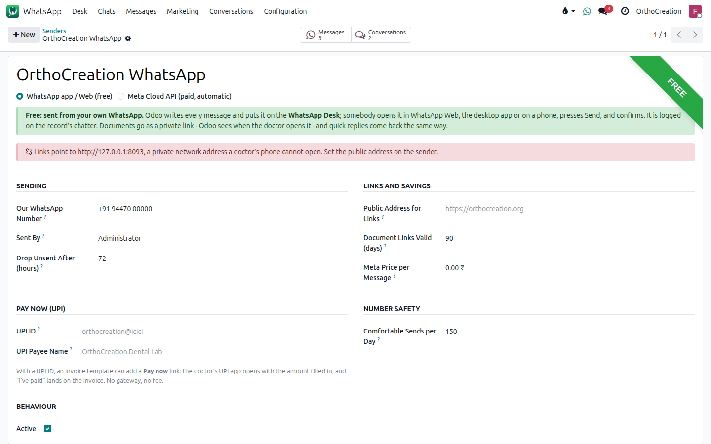

| Field | What to put |
| --- | --- |
| **Public Address for Links** | **Set this first.** The address doctors reach from outside - `https://arabiandentallab.com`. Every document, reply, payment and button link in a message starts with it. Left empty, Odoo uses its own address, which on the lab's network is something like `http://192.168.0.27:8069` - a link a doctor's phone cannot open. The sender form, the Desk and every send warn in red while that is the case. |

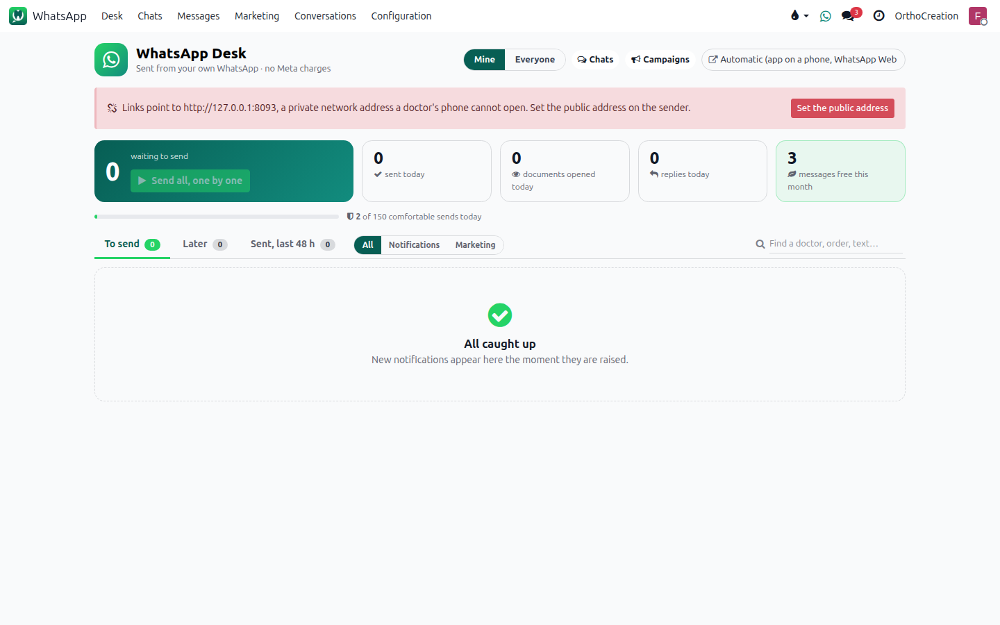
| **Our WhatsApp Number** | The lab's WhatsApp number. It is shown on every send, so the person sending can check the right WhatsApp is logged in. |
| **Sent By** | Who sends the automatic messages. Leave it empty and everyone with WhatsApp rights sees them. |
| **Drop Unsent After (hours)** | A message nobody sent within this time is cancelled. 72 hours by default: a dispatch notice three days late does more harm than good. `0` keeps them. |
| **Document Links Valid (days)** | How long a document link keeps working. 90 days by default. |
| **Send From / Send Until (hour)** | Quiet hours. A message prepared outside them waits on the Desk under **Later** until the lab opens - no invoice at 11 PM. `0` and `0`: any time. |
| **Meta Price per Message** | Optional. What Meta would charge per message; used only to show the savings. |

That is the whole setup. There is no token, no webhook and no template approval.

**Before you start sending**, open WhatsApp Web (web.whatsapp.com) once on the computer at the desk and scan the QR code with the lab's phone, so it stays logged in.

The person sending needs the **WhatsApp: send** right (Settings ▸ Users ▸ the user ▸ WhatsApp).

## The WhatsApp Desk

**WhatsApp ▸ Desk**, or the green WhatsApp icon in the top bar. The number on the icon is how many messages are waiting for you.

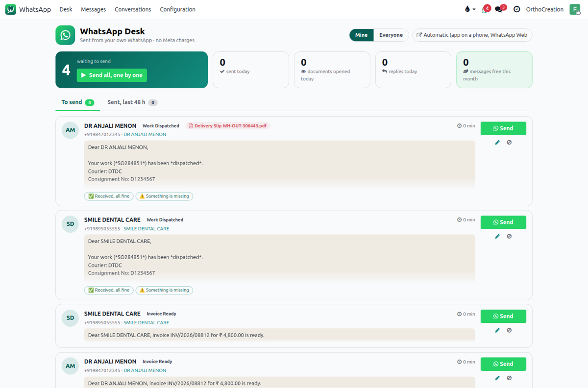

- **Waiting to send**: every message ready to go, oldest first. A red edge means it is close to being dropped.
- **Sent today, documents opened today, replies today**: tap any of them to see the messages behind the number.
- **Saved / messages free this month**: what the Cloud API would have charged.
- **Mine / Everyone**: your own messages plus unassigned ones, or everybody's.
- **Open in**: Automatic, WhatsApp Web, the desktop app, or your phone. It is remembered for you.

Each card shows the doctor, the template, the attached document, the quick replies and how long it has waited. The ✏️ button edits the text before sending; ⊘ cancels the message.

## Sending one message

Press **Send** on a card.

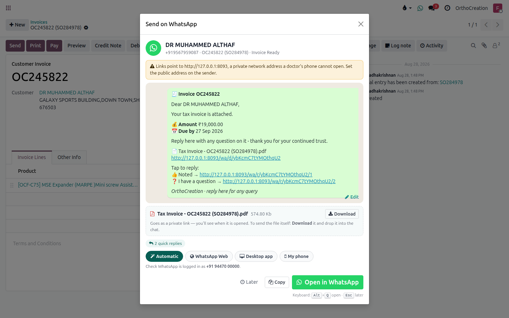

1. Read the message as the doctor will see it, with links and quick replies.
2. Check where it opens: **Automatic** opens the phone app on a phone and WhatsApp Web on a computer.
3. Press **Open in WhatsApp**. WhatsApp Web opens in one tab (the same tab every time) with the doctor's chat and the text typed in.
4. Press **Send** in WhatsApp.
5. Come back to Odoo. It notices you are back and asks:

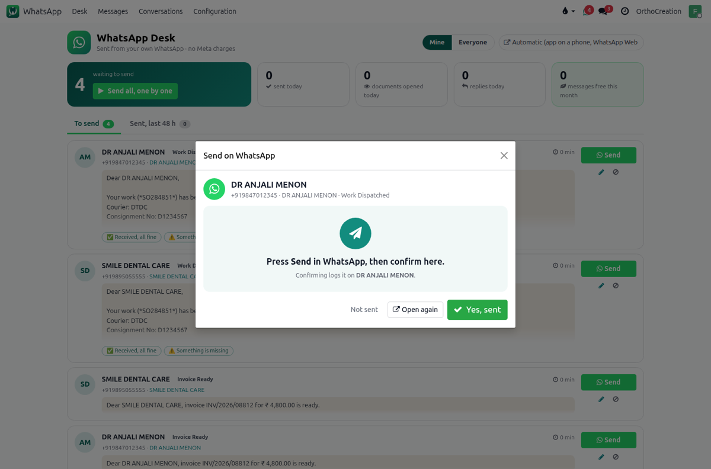

- **Yes, sent**: logged on the record, and the card moves to *Sent*.
- **Open again**: if WhatsApp was slow to load.
- **Not sent**: the message goes back on the Desk.

**Changing the words.** **Edit** under the preview opens the text; **Use these words** puts them back in the bubble, links and all.

**The document.** Under the preview the document is named the way the doctor will see it - *Tax Invoice - OC245822.pdf* - with its size. It travels as a private link in the text, so Odoo sees when it is opened. To put the file itself in the chat as well: on a computer, **Download** it and drop it into the WhatsApp Web chat; on a phone, **Share the PDF…** opens the phone's share sheet, where WhatsApp takes the file with the message as its caption.

## Sending a whole queue

Press **Send all, one by one**. The first message opens; after **Yes, sent** (or **Not sent**) the next one comes up by itself, with *3 / 12* in the title. Close the window at any time to stop; what was not sent stays on the Desk.

## Sending from a phone

If the lab's WhatsApp lives on a phone rather than on the computer, choose **My phone**.

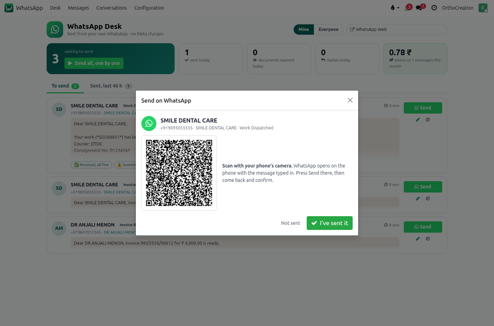

Scan the code with the phone's camera: WhatsApp opens on the phone with the message typed in. Send it there and press **I've sent it**.

On a phone, the Desk works directly: **Send** opens the WhatsApp app.

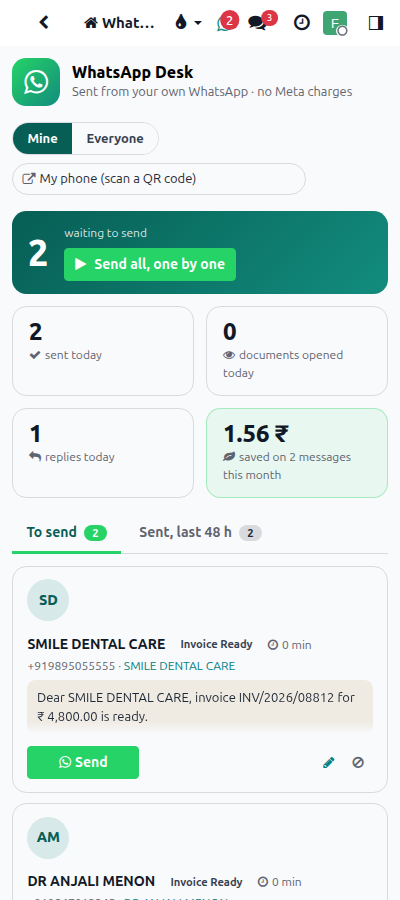

## Sending from an order, an invoice, a delivery

Every sale order, invoice, delivery and payment has a green **WhatsApp** button in its header.

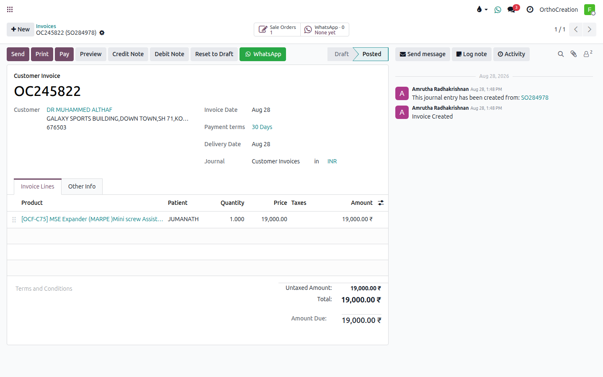

- **WhatsApp** is one click: the message already written for this moment - a posted invoice gets *Invoice Ready*, an overdue one *Payment Reminder*, a confirmed order *Case Registered*, a delivery *Work Dispatched*, a payment *Payment Received* - opens straight in the send window with its document, ready to **Open in WhatsApp**. **Edit** in that window changes the words before they go. Close it without sending and nothing is kept.
- Another message than the record's own moment: **Action ⚙ ▸ Send WhatsApp** opens the composer, where any template can be chosen and the text written freely, with an emoji and **{{ field }}** to drop in a field.
- **Add WhatsApp number** appears instead when the doctor has none: the contact's mobile is offered when it looks like one; check it, Save, and the button turns green. No trip to the contact.
- The stat button up top tells the record's WhatsApp story - *None yet*, *On the Desk*, *Sent 2 h ago*, *Opened 5 min ago*, *Replied just now* - and opens the chat with this record's messages marked.

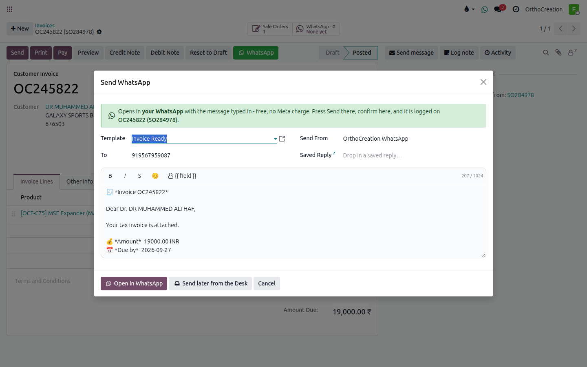

**From a list.** The invoice and order lists carry a WhatsApp icon on every row. Tick several and choose **Action ⚙ ▸ Send on WhatsApp**: each gets its own moment's message, they all land on the Desk, and the Desk opens so they can be sent in one sitting. Records without a number are counted, not sent.

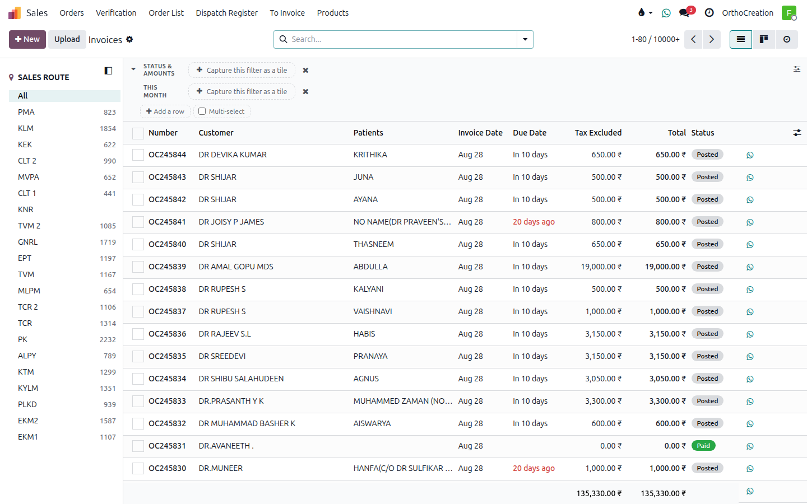

**On a contact** there are two buttons: **Send WhatsApp**, which opens the composer with the doctor greeted by name and any template a click away, and **Ask the doctor**. A contact with no number shows **Add WhatsApp number** instead.

**Ask the doctor.** A case stops at the bench for the same handful of reasons, and each is a message somebody used to write again at the counter. **Ask the doctor** on the contact opens the five ready questions — *Case details*, *Impression / Scan*, *Shade*, *Anything to collect*, *Approval to proceed* — with a box to name what it is about (`SO284978 · patient JUMANATH`), which goes in as the message's first line. Pick one, read it, open it in WhatsApp.

The generic templates — *Case Update*, *Delivery Update*, *Invoice Update*, *Message* — are a frame rather than a finished message: the greeting, what the doctor recognises the case by, and room for the line you actually want to write. They are what the WhatsApp button offers when a record is at no particular lab moment, such as a quotation or a draft invoice.

These are questions, so they carry no link: the doctor answers by writing back, and the reply waits in the **To answer** tray. The questions are ordinary templates — reword them, or add your own with one of the Enquiry events.

A contact has the same under **Action ⚙ ▸ Send WhatsApp**. The page reloads once a message is confirmed, so the chatter shows it straight away.

## What is logged on the chatter

Every confirmed message is posted on the record it is about (the invoice, the sale order, the contact) as an internal note: the doctor, the number, who sent it and the full text.

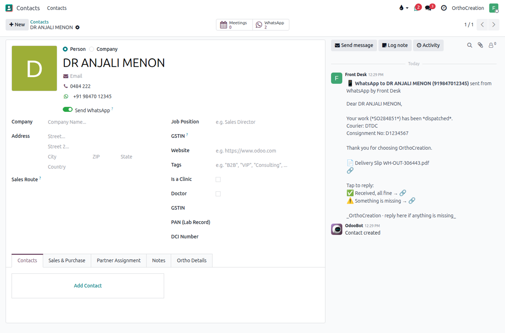

The private links are shown as 🔗, so nobody reading the record can press a doctor's reply button. The doctor opening the document, and every answer, are logged the same way.

## Documents and read receipts

A PDF cannot travel through a chat link, so the invoice, delivery slip or acknowledgement goes as a **private link** under the message:

    📄 Invoice INV/2026/08812.pdf
    https://arabiandentallab.com/wa/d/…

When the doctor opens it:

- they get the PDF on their phone, no login needed;
- the message turns **Read** (blue ticks on the *Sent* tab);
- the chatter says *"Dr … opened Invoice … from WhatsApp"*, once;
- **documents opened today** on the Desk goes up.

WhatsApp's own link preview is recognised and does not count as an open. If a message was opened in WhatsApp but nobody pressed *Yes, sent*, the doctor opening the link proves it went, and it is marked sent by itself.

Links stop working after **Document Links Valid (days)**; the doctor then sees a polite "link expired" page.

A document is named *Tax Invoice - OC245822.pdf*, *Registration Acknowledgement - SO294081.pdf*: the report and the record, as the doctor sees it in the chat. The link under it is short - sixteen characters - and starts with the sender's **Public Address for Links**; without that address set, the Desk and every send say so in red, because a link to the lab's own network is one a doctor cannot open. The file itself can go too, from the send window (see *Sending one message*).

## Placeholders that read well

A placeholder is a field in double braces: `{{name}}`, `{{partner_id.name}}`, `{{amount_total}}`. It comes out the way a message should read it, not the way the database stores it:

| The field | Comes out as |
| --- | --- |
| a date | `18 Sep 2026` |
| a date and time | `18 Sep 2026, 6:30 AM`, in the lab's time zone |
| an amount with a currency (`amount_total`, `amount_residual`, `amount`) | `₹19,000.00` |
| a plain number | `12.50` |
| a choice (`state`, `type`) | its label - *Sales Order*, not `sale` |
| a contact, a product | its name |

Where the default is not what you want, add a format after a bar:

| Write | To get |
| --- | --- |
| `{{date_order\|date}}` | the date without the time |
| `{{date_order\|time}}` | the time only |
| `{{partner_id.name\|doctor}}` | **Dr. Anjali Menon** - and *DR AMAL GOPU MDS* stays as it is: "Dr." is never said twice, and a clinic gets no "Dr." at all |
| `{{name\|first}}` | the first word - the first name |
| `{{name\|upper}}` / `\|lower` / `\|title}}` | the case changed |
| `{{amount\|money}}` | a plain number as money, in the company currency |
| `{{amount\|int}}` | no decimals |
| `{{field\|raw}}` | exactly as stored |

The editor's **{{ field }}** panel lists the fields and shows these formats; a format that does not exist is flagged under *Some placeholders will come out empty*. The lab's templates use them: `Dear {{partner_id.name|doctor}},` and `📅 *Received*  {{date_order|date}}`.

## Quick replies

**WhatsApp ▸ Configuration ▸ Templates** opens as a gallery: every template as the bubble the doctor sees, with how many went out and how many were read.

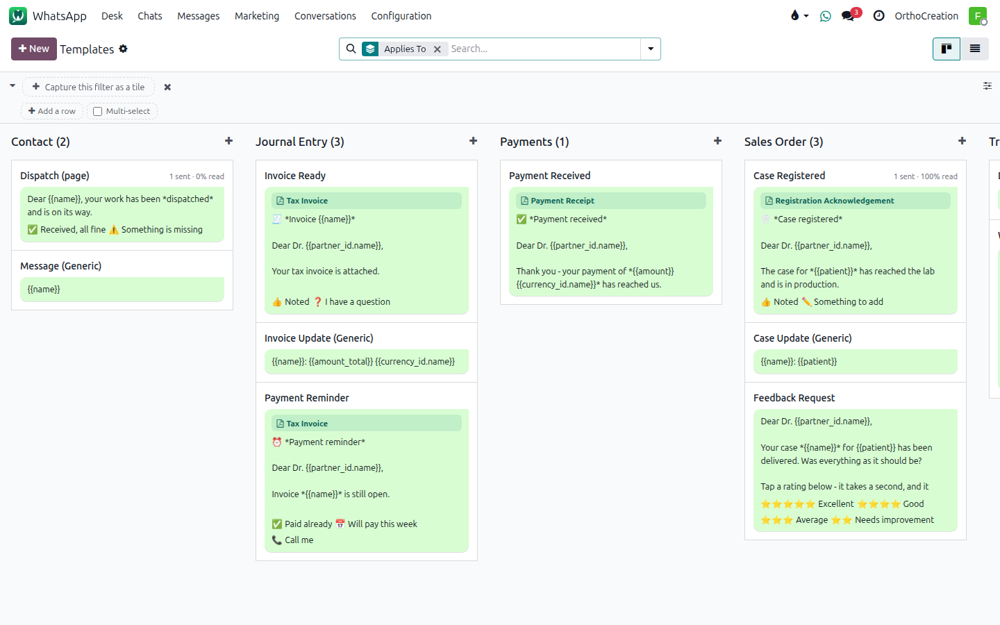

A template is written in a WhatsApp editor - bold, italic, emoji, and **{{ field }}** to drop in any field of the record - beside a phone preview that follows every keystroke.

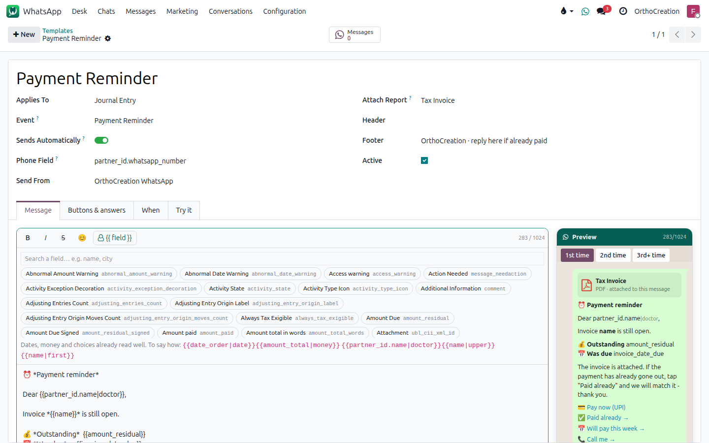

On its **Buttons & answers** page, write one answer per line under **Quick Replies**:

    ✅ Received, all fine
    ⚠️ Something is missing

Each answer becomes a link at the bottom of the message. The doctor taps one and sees:

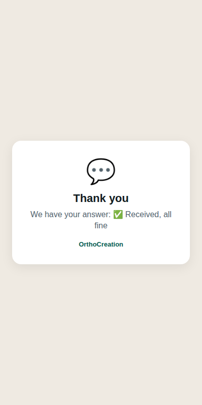

The answer is logged on the record's chatter and shown on the Desk. Tapping twice records it once.

Already set up for the lab:

| Template | Quick replies |
| --- | --- |
| Case Registered | 👍 Noted · ✏️ Something to add |
| Work Dispatched | ✅ Received, all fine · ⚠️ Something is missing · 📞 Please call me |
| Invoice Ready | 👍 Noted · ❓ I have a question |
| Payment Reminder | ✅ Paid already · 📅 Will pay this week · 📞 Call me |
| Feedback Request | ⭐⭐⭐⭐⭐ Excellent · ⭐⭐⭐⭐ Good · ⭐⭐⭐ Average · ⭐⭐ Needs improvement |

## Link buttons and the message page

Under **Link Buttons** on the same page, one per line, `Label | link`:

    Track my case | https://arabiandentallab.com/track/{{name}}
    Call the lab | tel:+919447000000

The link may hold placeholders. Each becomes a 🔗 line the doctor taps; the tap goes through our own address first, so it is logged on the record (*tapped "Track my case"*) and counts as read, then on to where it points. Campaigns and automations take link buttons too.

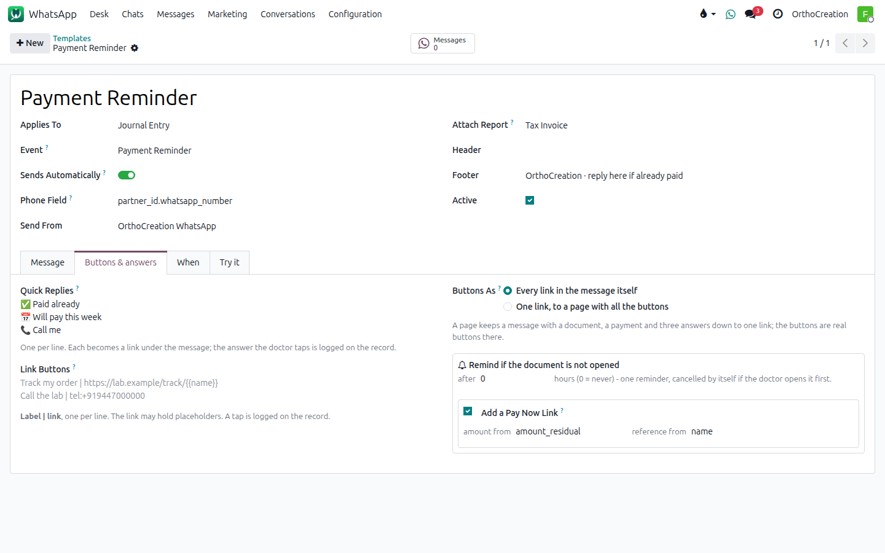

**Buttons As** decides how they travel:

- **Every link in the message itself** - the document, the payment, each answer and each button is its own line. Fine for a message with one or two.
- **One link, to a page with all the buttons** - the message ends with a single link, and the page shows the text with real buttons: the document, Pay now, the answers, the link buttons, and *Chat with us on WhatsApp*. A dispatch notice with a slip, three answers and a tracking link is one link instead of six.

**WhatsApp itself draws no buttons** for a message sent from the app or the Web - only Meta's paid templates do, which is the bill this replaces. The page is how a free message gets buttons, and **The Link Says** is what that one link reads as: *🧾 Invoice, pay now & reply*, *📦 Delivery slip & confirm*, *⭐ Rate this case*. WhatsApp shows it as a card carrying the message's own heading and its facts.

**The page says where the case stands.** Under the text it lists what the record knows now, not only what the message said when it was sent: an order's stage and patient, an invoice's amount, due date, outstanding and paid status, a delivery's courier and consignment number. A doctor who taps *Open case* a week later sees where the work has got to.

All the lab's templates are set this way. Their links: *📋 Open case*, *📦 Delivery slip & confirm*, *🧾 Invoice, pay now & reply*, *💳 Pay now or tell us*, *⭐ Rate this case*, *🧾 Open your receipt*.

**The case message and the portal.** *Case Registered* no longer carries the acknowledgement PDF. A doctor who can sign in gets a **📋 My orders** button to their own order list on the portal, which is always current; a doctor with no login gets no button at all - a link whose address comes out empty is dropped, so one template serves both.

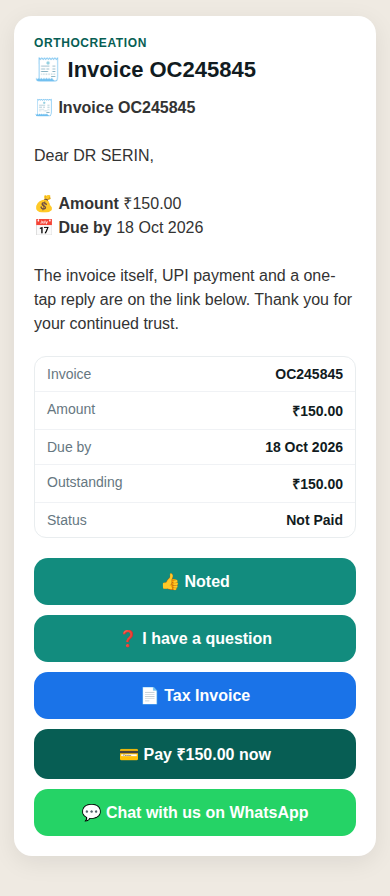

Opening the page counts as read and is noted on the chatter.

## Answers that need a person

An answer is not always news: "⚠️ Something is missing" and "📞 Please call me" are a doctor asking for something, and a chatter note is not an answer.

On the template's **Buttons & answers** page, list under **Answers That Need a Person** the answers that do. Write them exactly as in Quick Replies. When one is tapped:

- a **to-do** appears on the case itself - the order, the invoice, the delivery - saying who said what and when;
- it goes to whoever the record belongs to (the salesperson on an order, the accountant on an invoice), or to the person named in **To-do For**.

The lab's templates already name theirs: *Something is missing*, *Please call me*, *Something to add*, *I have a question*, *Paid already*, *Call me*, and *⭐⭐ Needs improvement* on the feedback request.

**The To answer tray.** Everything a doctor says - a tapped answer or a message they typed - waits on the Desk under **To answer** until somebody deals with it.

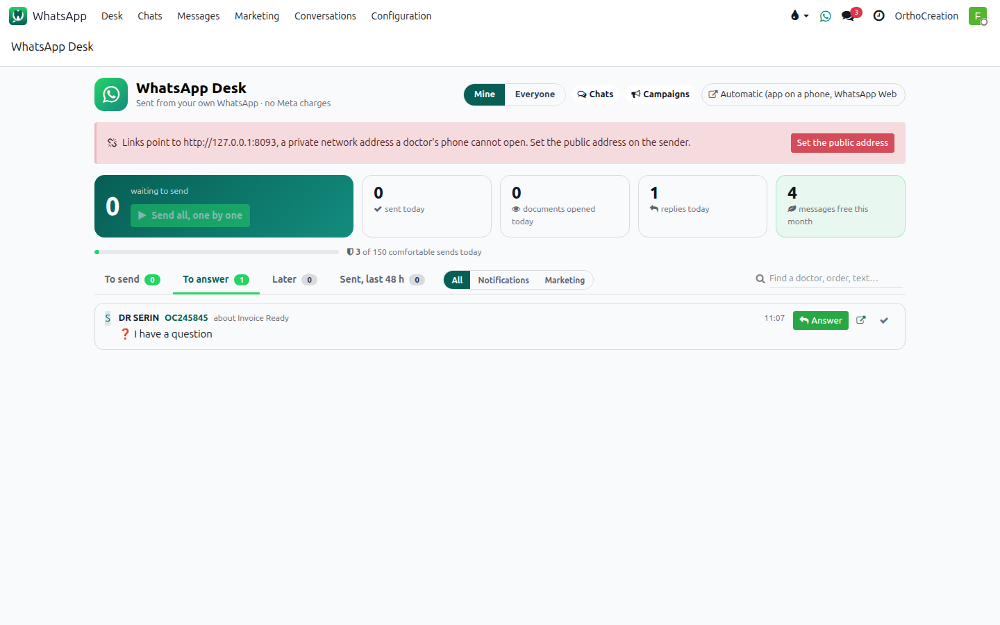

Each line shows the doctor, the case it is about, what they said and when, with three buttons: **Answer** opens their chat, the arrow opens the case, and the tick takes it off the tray when there is nothing to do. Answering them on WhatsApp takes it off by itself - the tray is what is still waiting, not a log.

## Replies typed in WhatsApp

A doctor who writes back in WhatsApp replies to the lab's WhatsApp, not to Odoo. To keep it on the record, open the Desk's **Sent** tab, press **Log reply** on the message and paste the answer.

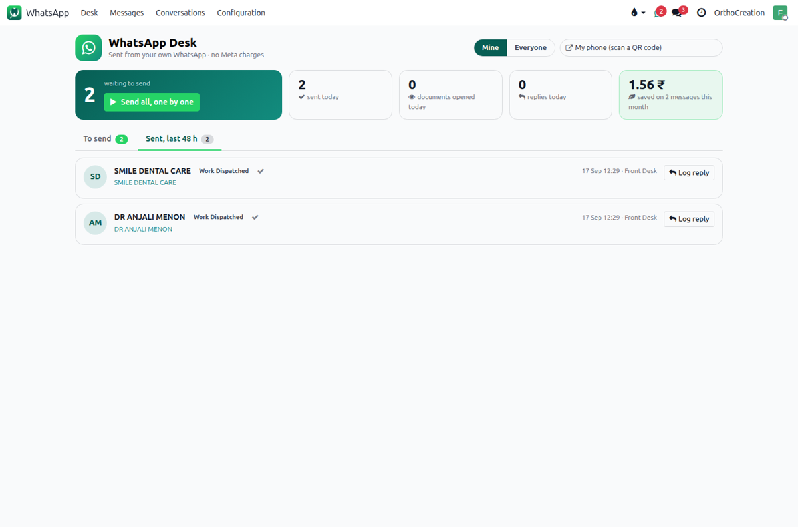

## One WhatsApp per doctor

When several messages wait for the same doctor (the dispatch notice and the invoice, say), the Desk shows them together in a green group.

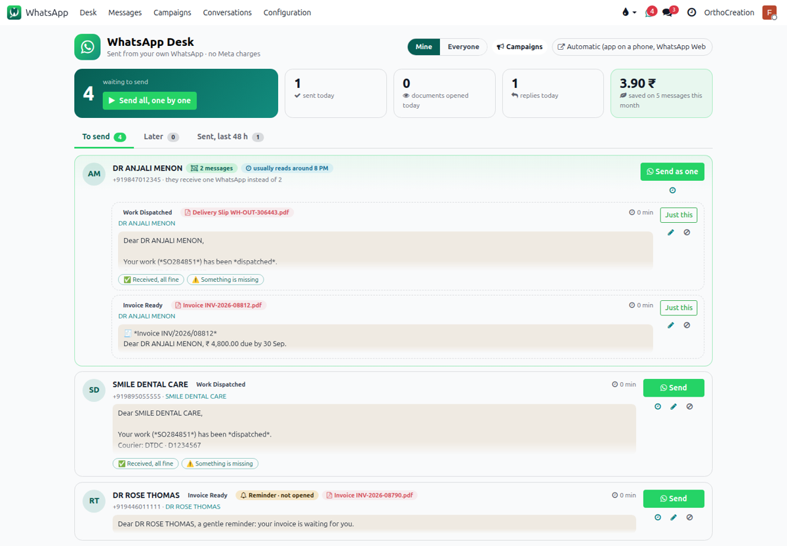

- **Send as one** opens WhatsApp once, with both messages one under the other, a thin line between them and the footer said once at the end. Each keeps its own document link and quick replies, and each is logged on its own record.
- **Just this** sends one of them on its own.
- **Send all, one by one** goes doctor by doctor, so a doctor with three messages gets one WhatsApp.

## Best time and Later

Every document a doctor opens and every quick reply they tap tells Odoo when they read WhatsApp. After three of them, the Desk shows it beside their messages: *usually reads around 8 PM*.

Press 🕒 on a card (or **Later** in the send window) to send it later:

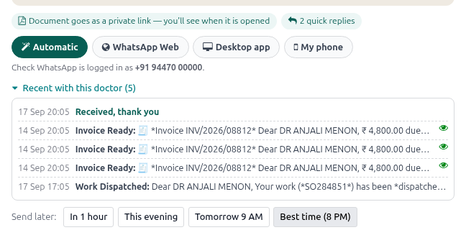

| Choice | When it comes back |
| --- | --- |
| In 1 hour | an hour from now |
| This evening | 6 PM today (tomorrow if it is already evening) |
| Tomorrow 9 AM | 9 AM tomorrow |
| Best time | the doctor's usual hour, today or tomorrow |

Snoozed messages wait on the **Later** tab and are left out of the counter until they are due; **Send now** brings one back. A snoozed message is not dropped for being old while it waits.

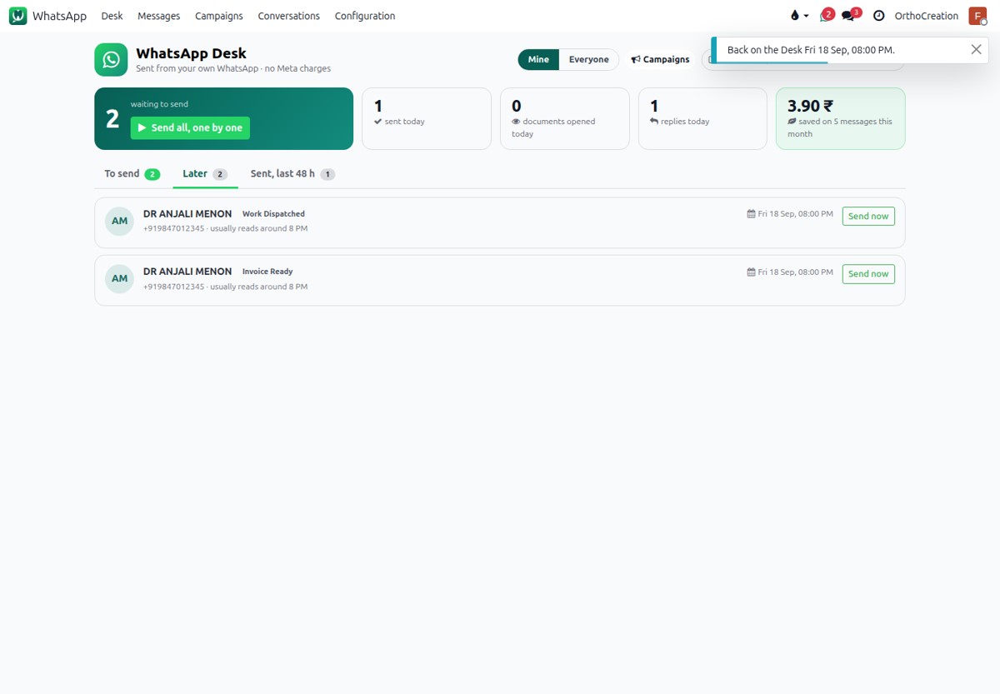

## Reminders for unopened documents

On a template with a document (**Configuration ▸ Templates ▸ Message**), set **Remind if the document is not opened after N hours** and write the reminder:

    Dear Dr. {{partner_id.name}}, a gentle reminder: invoice *{{name}}* is waiting for you.

If the doctor has not opened the document by then, a short reminder with the same document link appears on the Desk, marked **Reminder · not opened**. There is only ever one reminder per message, and:

- if the doctor opens the original before the reminder is sent, the reminder cancels itself;
- if they open the reminder's link, the original counts as read too.

The lab's **Invoice Ready** template reminds after **48 hours**.

## A template that knows when

Three more things a template can say, on its **Message** and **When** pages:

**The second and third time.** Under *When it goes to the same record again*, write what the second sending says, and the third and after. The lab's **Payment Reminder** does: a reminder, a firmer second reminder, then *Payment overdue* with *Call me*. The preview switches between **1st / 2nd / 3rd+ time** so each can be read as the doctor will. Empty means the same message every time.

**Lines with nothing in them go.** A dispatch notice with no courier used to carry "🚚 *Courier*" and nothing after it. A line whose placeholders all come out empty is left out and the gap closes; a line the author wrote as words always stays. Switched on per template, beside the message.

**The doctor's own language.** The message, its heading, its footer, its answers and its link label are translatable: press the globe beside each and write the Malayalam version. A doctor is written to in the language their contact carries; one with no language, or a language nothing was written in, gets the message as it stands. The **Languages** page names the ones a version exists in.

**How it is doing.** Under the title, once a template has been used: how many were read, how many were answered, how long a doctor takes to open it, which answers they actually tap, and one sentence about it — *Rarely opened - the first line is what a doctor decides on*, *Read, but hardly ever answered - are the answers worth tapping?*

**Send Only When.** A rule on the record, in the usual filter editor: `amount_total > 0`, or a customer tag. A record the rule does not fit is skipped, with a line in the log. A rule that cannot be read lets the message through rather than silencing every invoice.

**Wait Before Sending (hours).** An automatic message waits this long after its moment. The lab's **Feedback Request** waits 20 hours: a doctor rates work they have seated, not a parcel just scanned. The message sits in the queue and is prepared for the Desk when its hour comes - and if that hour falls in the sender's quiet hours, it waits for opening time.

**Sends Automatically** on the template form is the same switch as on the WhatsApp settings page: turning *Invoice Ready* off here stops invoices going out on their own.

## Before it goes: warnings and history

The send window says what you should know first:

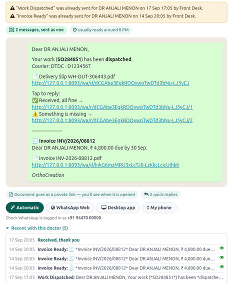

- **Already sent**: the same template for the same record went out in the last 7 days, with when and by whom.
- **Messaged minutes ago**: this number got a message in the last half hour.
- **Recent with this doctor**: the last few messages both ways, with 👁 where a document was opened.

## Campaigns

For news to many doctors: holiday closures, a new appliance, a price list. **WhatsApp ▸ Campaigns ▸ New**, or select contacts in **Contacts** and use **Action ▸ WhatsApp campaign**.

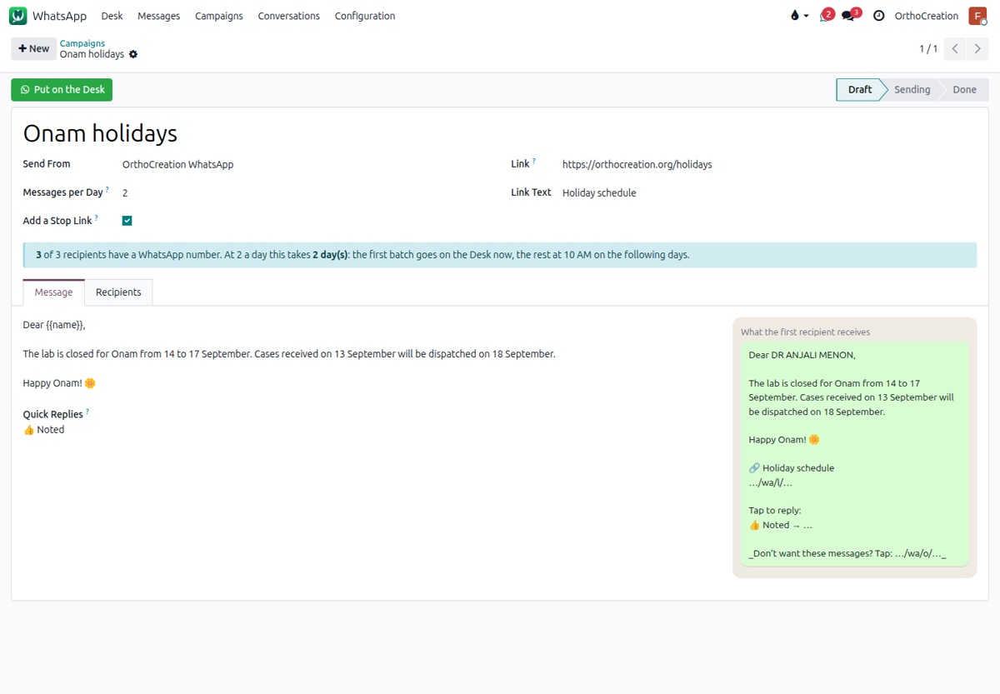

| Field | What it does |
| --- | --- |
| **Message** | Written once; `{{name}}` and other contact fields are filled in per doctor. |
| **Link** and **Link Text** | Optional. Sent as a tracked link, so you see who opened it. |
| **Quick Replies** | Answers the doctor can tap, as on templates. |
| **Add a Stop Link** | Ends each message with a private link to stop these messages. |
| **Messages per Day** | At most this many go on the Desk per day; the rest wait for the following days at 10 AM. |

**Put on the Desk** creates one message per doctor with a WhatsApp number (a number shared by two contacts gets one message) and paces them over the days needed. They are sent from the Desk like everything else.

**Why pace it.** WhatsApp watches for a number that suddenly messages many people. Forty a day, sent by a person, is ordinary use; four hundred in an hour is how a number gets blocked.

**The stop link.** Tapping it opens a page asking *Stop these messages?* with a reason to tap - *Too many messages*, *Not relevant to me*, *Wrong number*, *Just stop*; only a tap stops them. WhatsApp's link previews open every link in a chat, and this is what keeps them from unsubscribing anyone.

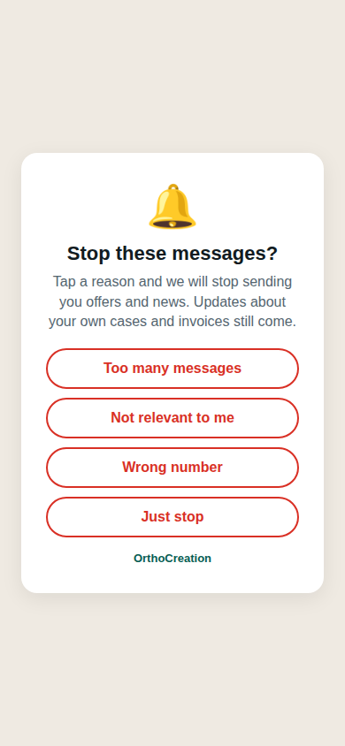

A stop under a campaign or an automation stops **offers and news only**. The doctor:

- has **Offers & news** switched off on their contact, which every campaign, automation and audience respects;
- loses any offer already waiting for them on the Desk;
- keeps getting their own case updates, invoices and reminders - the stop link said "these messages", and a doctor tired of offers has not asked to stop hearing that their case shipped;
- gets a note on their chatter, with the reason.

Only the word STOP typed on the paid Cloud API channel stops the whole number.

The campaign form counts **Waiting**, **Sent**, **Opened link** (with the rate), **Replied**, **Stopped** and **Interested**; each opens the messages behind it. **Stop** cancels whatever has not gone yet.

**Follow up the silent** makes a new campaign to whoever did not open or answer; **Duplicate** copies one for next time.

## Marketing: audiences, ideas and automations

**WhatsApp ▸ Marketing** holds what makes a campaign a two-minute job.

**Ideas** are ready-made campaigns - New Year greetings, a festival, a new service, an offer, "we miss you", a referral ask, a feedback round, changed hours. **Use it** opens a campaign with the text and answers filled in; change the words and launch.

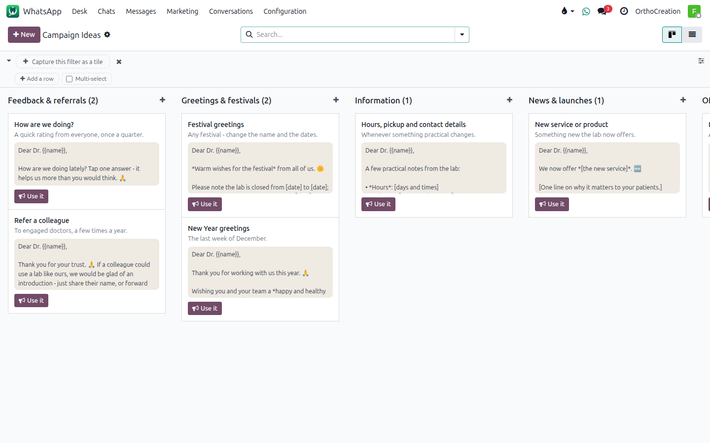

**Audiences** say who, once, and are reused by every campaign after. Start from *Everyone with a WhatsApp number*, *Engaged*, *Quiet* or *Never messaged*, then narrow with the usual contact filter (city, tag, salesperson) and, if wanted, a **Recent activity** rule such as *nothing newer than 45 days* on `sale_order_ids.date_order`. The count and a few names are shown as you build it, counted from the day it is used, so "no case in 45 days" stays true next month. Contacts who asked to stop, and contacts with **Offers & news** off, are never in an audience.

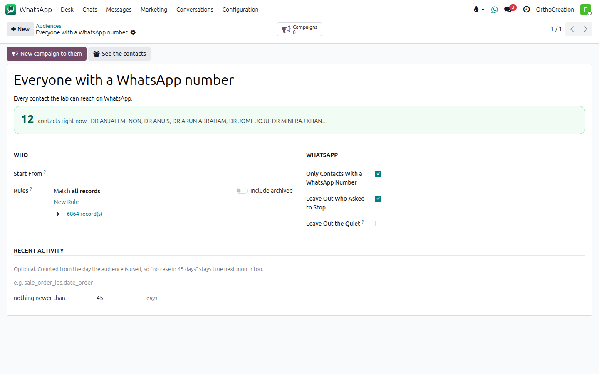

On a campaign, pick the **Audience** and **Load** fills the recipients. **Send On** and **At each doctor's usual time** pace the launch; **The "Interested" reply** is the answer that turns a doctor into a to-do for their salesperson.

**The flyer.** Give a campaign a picture and a headline and the message links to a page on the lab's own address that shows the picture, the words and the buttons - what a WhatsApp message with a photo looks like, without the API.

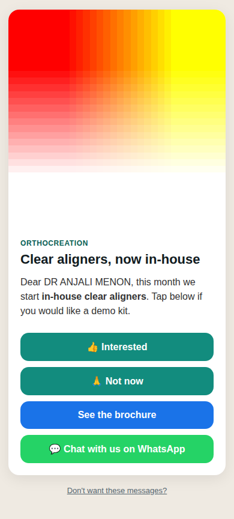

**Broadcast mode** is for a WhatsApp broadcast list: the campaign becomes one text with the campaign's links, to copy into WhatsApp and send once. Answers and stops come back through the page, which asks the doctor's number.

**Automations** send themselves: an audience, a message, how often at most (*Not again within 90 days*), how many a day, at what hour. *We miss you* to every doctor with no case in 45 days appears on the Desk each morning on its own; **Run now** does a day's worth immediately.

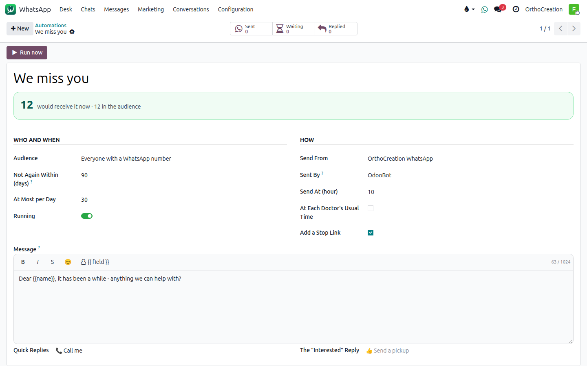

The Desk's **All / Notifications / Marketing** chip keeps offers apart from case updates, so the morning's invoices can go first.

## Chats

**WhatsApp ▸ Chats**, the **WhatsApp chat** button on a contact, or the **WhatsApp** stat button on an order, invoice, delivery or payment - which opens the doctor's chat with that record's own messages marked. Everything said to a doctor and everything they answered, as a chat app shows it.

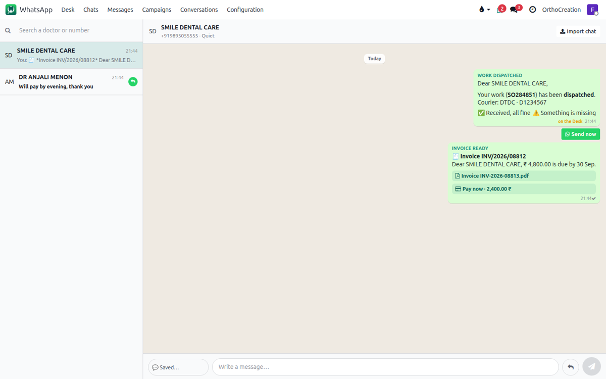

- **The list**: newest first, with the last message. A green arrow means the doctor wrote last and may be waiting for an answer. Search by name or number.
- **The thread**: our messages on the right with ticks (two when the document was opened), the doctor's on the left. Under a message: *opened the invoice*, *opened the payment page*, *says paid*. A message still on the Desk says so, with **Send now** beside it.
- **Writing**: type in the box and press the paper plane (or Ctrl+Enter). It goes to the same send window as the Desk. **💬 Saved…** drops in a saved reply. The ↩ button logs something the doctor wrote in WhatsApp.
- **Import chat** brings a whole exported chat in (see below).

On a phone the list and the thread take turns, with a back arrow.

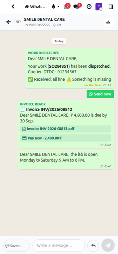

## Pay now (UPI)

An invoice message can carry a **Pay now** link. No payment gateway and no fee: the doctor pays from their own UPI app to the lab's UPI ID.

1. On the sender (**Configuration ▸ Senders**), fill in **UPI ID** and **UPI Payee Name**.
2. On the invoice template, tick **Add a Pay now link**. The lab's Invoice Ready template already has it; the link only appears once the UPI ID is set.

The doctor taps the link and sees:

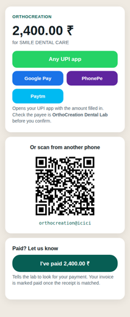

- the amount and what it is for;
- **Any UPI app**, **Google Pay**, **PhonePe** or **Paytm**: their app opens with the lab as payee and the amount filled in;
- a **QR code** to scan from another phone;
- **I've paid**: tells the lab.

What comes back: *opened the payment page* and *says they have paid* on the invoice's chatter, **says paid** on the Desk and in the chat, and a **to-do on the invoice** for the accountant to find the receipt and register the payment. The invoice is never marked paid by the button; only a registered payment does that.

## Saved replies

**Configuration ▸ Saved Replies**: the sentences the desk types every day, such as opening hours or "your case will be ready on Thursday". `{{name}}` and other fields are filled in for the doctor. Pick one from **Saved Reply** in the send window, or from **💬 Saved…** in a chat; it is added to whatever is already written.

## Bringing a WhatsApp chat in

What a doctor types in WhatsApp stays on the lab's phone unless it is logged. To bring a whole conversation in: in WhatsApp open the chat, **⋮ ▸ More ▸ Export chat ▸ Without media**, and save the text file. Then on the contact, **Action ▸ Import WhatsApp chat** (or **Import chat** in Chats).

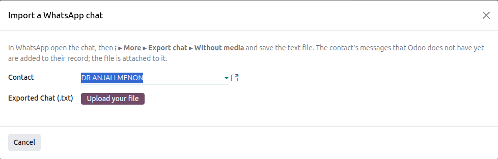

Odoo reads the file, works out which name is the doctor's, and adds their messages that it does not already have (a quick reply or a logged reply already on the record is recognised and not added twice). The file itself is attached to the contact, and the chatter says how many messages came in. Tick **Also our messages** to log the lab's own lines too.

## Who is engaged

Every contact now shows how they stand on WhatsApp, on the **WhatsApp chat** button of their form:

| | Meaning |
| --- | --- |
| **Engaged** | opened a document, tapped a link or answered in the last 90 days |
| **Quiet** | messaged, but nothing back in that time |
| **Never messaged** | no WhatsApp yet |
| **Stopped** | asked not to be messaged |

Beside **Send WhatsApp** on the contact sits **Offers & news**: off, and no campaign or automation reaches them while their own updates still do. The stop link under an offer switches it off; a person switches it back on.

In **Contacts ▸ Filters** the same four are filters, plus *WhatsApp marketing off*, so "engaged doctors in Kochi" is one search. A campaign counts them under **Recipients** and **Keep only engaged doctors** drops the quiet and the stopped before it is launched.

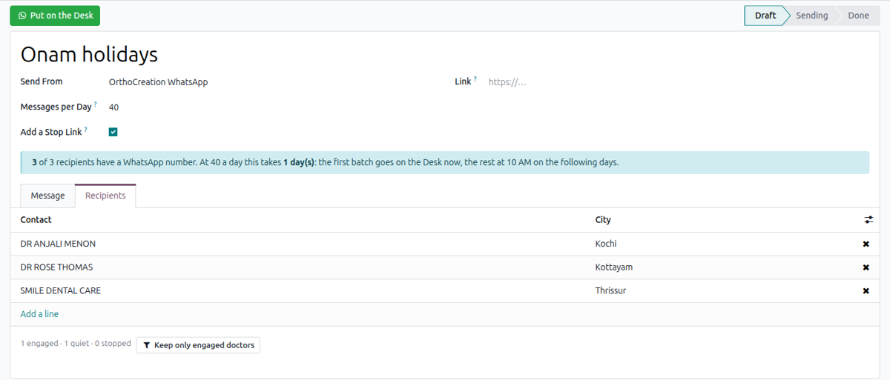

## Keeping the number safe

WhatsApp watches a number that suddenly sends a great deal. The Desk shows **today's sends against a comfortable limit** (150 a day on the sender; change it under **Number safety**). The bar turns amber at 70% and red at the limit, and the send window then warns before each message. Nothing is blocked: it is the lab's own decision.

## When WhatsApp will not open

On a locked-down computer or an unusual browser, the send window has two more ways:

- **Copy**: copies the finished text; paste it into the doctor's chat in WhatsApp yourself, then confirm.
- **Share…** (on a phone): the phone's share sheet, where WhatsApp or WhatsApp Business is picked.

On a computer, the keyboard works too: **Alt+Q** opens, **Alt+S** confirms sent, **Esc** leaves it for later.

## Messages nobody sent

- A message waiting longer than **Drop Unsent After** is cancelled with the reason, so old news never goes out.
- A message *opened* in WhatsApp but never confirmed is **not** dropped: it may have gone. It stays on the Desk as *Opened — not confirmed* until someone confirms it or presses *Not sent*.
- A doctor who has switched WhatsApp off (the **Send WhatsApp** toggle on the contact), or whose number is blacklisted, is refused when the message is prepared and again when it is opened.

Every message, sent or not, is in **WhatsApp ▸ Messages**, with filters for *To send*, *Opened by the recipient* and *Replies*.

## What it saves

Set **Meta Price per Message** on the sender and the Desk shows, for the month, how many messages went out free and what the Cloud API would have charged for them.

## The paid Cloud API

Everything that existed before still works. Choose **Meta Cloud API (paid, automatic)** on a sender to send without anyone pressing a button: Phone Number ID, token, webhook, approved templates, the 24-hour window and simulation mode are all where they were. Messages sent this way are now logged on the chatter too.

A lab can mix both: one sender per channel, and each template names the sender it goes from.

## Questions

**WhatsApp Web opens but the text is missing.** WhatsApp Web was still loading. Press **Open again**.

**It opened the wrong WhatsApp account.** WhatsApp Web uses whatever phone was scanned into it. Log out there and scan with the lab's phone.

**The desktop app does not open.** Install WhatsApp Desktop, or choose WhatsApp Web.

**The doctor says the link does not open.** Almost always the address: open the sender (**Configuration ▸ Senders**) and set **Public Address for Links** to `https://arabiandentallab.com`. Until it is set, links carry whatever address the admin last logged in from - on the lab's network a `192.168…` one that only the lab can open - and the sender form, the Desk and every send say so in red. Otherwise the link may simply have expired (see *Document Links Valid*).

**Nothing appears on the Desk.** Check the sender is set to *WhatsApp app / Web*, the event is switched on in *Settings ▸ WhatsApp*, and the doctor has a **WhatsApp Number**. Messages only ever go to that number, never to the phone.

**Can WhatsApp ban the number?** Sending is done by a person, one message at a time, to doctors who work with the lab: that is normal use. Avoid sending many identical messages to people who have never talked to the lab.
