# Bank Reconciliation — User Guide

**Module:** `lab_bank_reconciliation` · **Odoo:** 19 Community · **Menu:** Accounting ▸ Accounting ▸ Bank Reconciliation

This guide is for the accounts team. It shows how to check the books against the bank
passbook and prepare the Bank Reconciliation Statement (BRS).

In short: **type the passbook's closing balance, work down the passbook one line at a time,
and mark the statement reconciled when the difference is zero.** Everything else on the
screen is there to help with those three steps.

The screenshots were taken on the staging copy of the live books (CANERA BANK,
Arabian Dental Lab), so the figures in them are real.

---

## Contents

1. [What this module does](#1-what-this-module-does)
2. [Before you start](#2-before-you-start)
3. [The banks overview](#3-the-banks-overview)
4. [The matching screen at a glance](#4-the-matching-screen-at-a-glance)
5. [First reconciliation: the opening balance](#5-first-reconciliation-the-opening-balance)
6. [Working down the passbook](#6-working-down-the-passbook)
7. [Ticking entries directly](#7-ticking-entries-directly)
8. [Entry details](#8-entry-details)
9. [New bank entry](#9-new-bank-entry)
10. [Queries with the bank, and the query letter](#10-queries-with-the-bank-and-the-query-letter)
11. [Filters](#11-filters)
12. [Day totals](#12-day-totals)
13. [Undo](#13-undo)
14. [Possible duplicates](#14-possible-duplicates)
15. ["Why is there a difference?"](#15-why-is-there-a-difference)
16. [Mark Reconciled, and the next statement](#16-mark-reconciled-and-the-next-statement)
17. [Printing: the BRS, Excel and the More menu](#17-printing-the-brs-excel-and-the-more-menu)
18. [Keyboard shortcuts](#18-keyboard-shortcuts)
19. [Phone and tablet](#19-phone-and-tablet)
20. [Rules the module enforces](#20-rules-the-module-enforces)
21. [Questions and troubleshooting](#21-questions-and-troubleshooting)
22. [Glossary](#22-glossary)

---

## 1. What this module does

Receipts in these books are posted **straight into each bank's ledger account**; no bank
statement files are imported. Reconciling a bank therefore means ticking the ledger lines
that also appear in the passbook, each with the date the bank cleared it. The module
works out the statement:

| Line | Meaning |
|---|---|
| **Balance as per books** | Every posted line on the bank's ledger account up to the statement date, from any journal, including the opening balance. |
| **Less: deposits not yet credited** | Money the books show coming in that the bank has not credited by the statement date. |
| **Add: payments not yet presented** | Money the books show going out that the bank has not debited by the statement date. |
| **Books, adjusted** | Books − deposits not credited + payments not presented. |
| **Balance as per bank** | The passbook's closing balance, typed by you. |
| **Difference** | Bank − books adjusted. It must be **0.00** to reconcile. |

**Posted journal entries are never changed by ticking.** Each tick is kept as its own record,
with who ticked it and when. An entry cleared *after* the statement date still counts as
outstanding on that statement, so an old BRS always reprints exactly as it stood.

---

## 2. Before you start

| You need | Why |
|---|---|
| **Accounting** access (*Show Full Accounting Features*, or Administrator) | To reconcile, post bank entries and raise queries. Read-only accounting users can view and print. |
| The **passbook or bank statement** up to the date you are reconciling | You work down it. |
| A **Bank Charges** account and an **Interest** account | Only for charges or interest the books do not have, and for booking short credits. Set them once on the statement form; later statements of the bank carry them forward, with **Short Credits up to**. |

Only an **accounting Administrator** can reopen a reconciled statement.

---

## 3. The banks overview

**Accounting ▸ Accounting ▸ Bank Reconciliation** opens one card per bank.

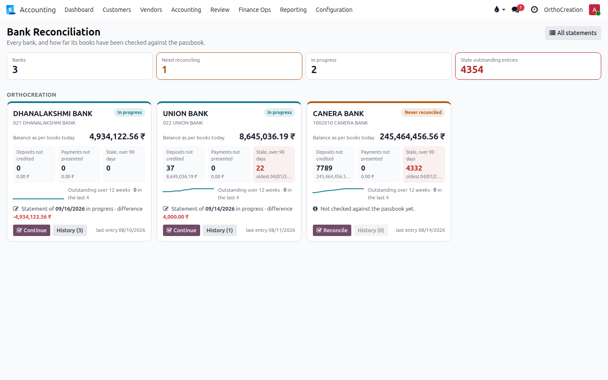

- **At the top:** how many banks there are, how many need reconciling (never, or not for
  35 days), how many are in progress, and how many outstanding entries are stale.
- **Each card:** the ledger account the bank's entries really post to, the balance as per
  books today, what is still outstanding, stale entries and the oldest, and where the
  reconciliation stands.
- **Reconcile / Continue** opens the bank's open statement, or starts one dated today.
  It never creates a second open statement.
- **History** lists the bank's statements.
- **The small line** on each card is the number of outstanding entries at the end of each
  of the last 12 weeks, with how much it has changed in the last four (red when growing):
  whether the bank is being kept up, or falling behind.

> The card shows the account the journal's entries **actually** use. For example, CANERA
> BANK's journal is set to 1050, but its entries are in **1002010 CANERA BANK**. You can
> change the account on the statement form.

To reconcile **as on a past date** (for example month-end), open the statement form and
change the **Statement Date**. Only entries up to that date count.

---

## 4. The matching screen at a glance

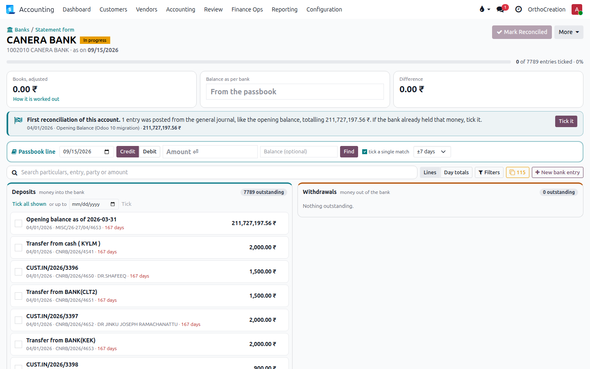

From top to bottom:

1. **Header.** The bank, the account, the statement date, and when this account was last
   reconciled. On the right: **Mark Reconciled** and **More** (printing, Excel, the query
   letter, keyboard shortcuts, statement settings).
2. **Progress bar.** How many of the entries this statement covers are ticked.
3. **Three figures:** *Books, adjusted*, *Balance as per bank* (type it here) and
   *Difference*. **How it is worked out** opens the full six-line statement.
4. **The next step.** One card that tells you what to do now: tick the opening balance,
   type the bank balance, look at why there is a difference, or mark the statement
   reconciled.
5. **Passbook line.** Where you type the passbook, one line at a time
   ([section 6](#6-working-down-the-passbook)).
6. **Tools:** search, **Lines / Day totals**, **Filters**, **Undo**, possible duplicates,
   and **New bank entry**.
7. **Deposits** (money into the bank) and **Withdrawals** (money out), side by side.

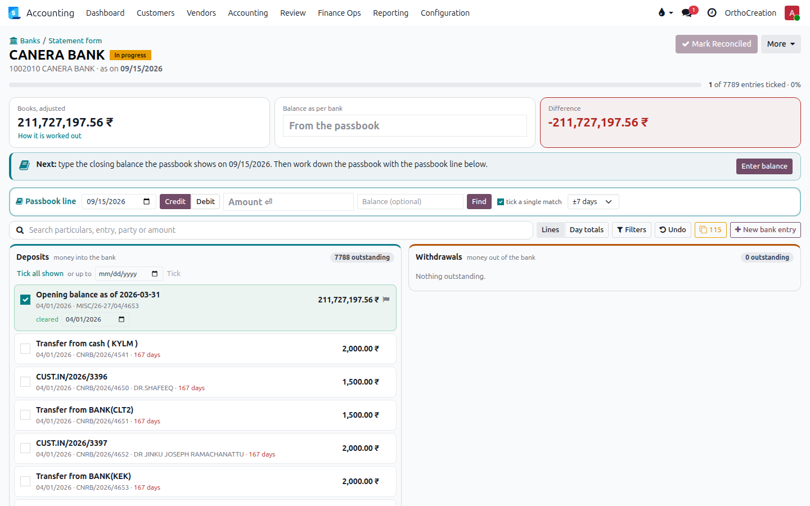

Each line in the columns shows the particulars, the date, the entry number and the party,
and its amount:
- Stale entries show their age in red.
- A line under query shows the query in orange.
- A ticked line shows its cleared date.
- **Click a line's text** to see everything behind it ([section 8](#8-entry-details)).
- **Click its box** to tick it.

---

## 5. First reconciliation: the opening balance

The first time a bank is reconciled, the opening balance (posted from the general journal on
01-04-2026) looks like a deposit the bank has "not credited". On CANERA BANK that is
211,727,197.56. The next-step card offers to tick it:

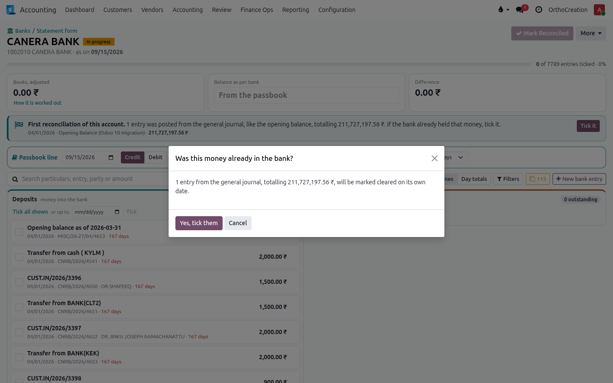

If the bank already held that money, which is normal for an opening balance, click
**Tick it** and confirm. The card then moves on to the next step.

---

## 6. Working down the passbook

This is the heart of the screen. Take the passbook page, and for each line:

1. Set the **date** as printed.
2. Choose **Credit** (money into the bank) or **Debit** (money out).
3. Type the **amount** and press **Enter**.

What happens next depends on what the books have:

**Exactly one outstanding entry has that amount** near the date (and no whole batch adds up to
it): that entry is ticked at once, as cleared on the passbook's date. A message says what was
ticked, with an **Undo** button. The cursor goes back to the amount, ready for the next
passbook line. Combinations of several entries that happen to add up to the same figure do
not stop this; on a busy bank almost any figure can be made up that way.

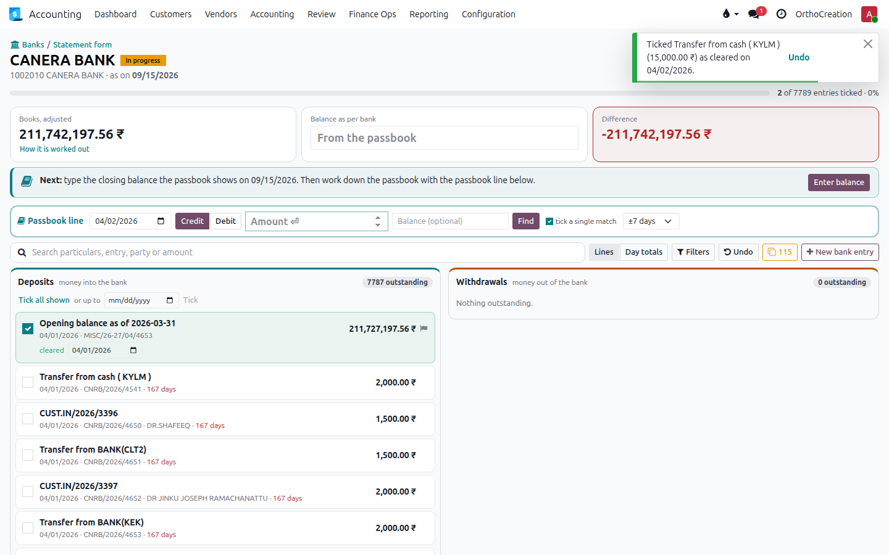

**Otherwise** (several entries of that amount, a whole batch, or only combinations): the
answers are listed; click **Tick** on the right one.

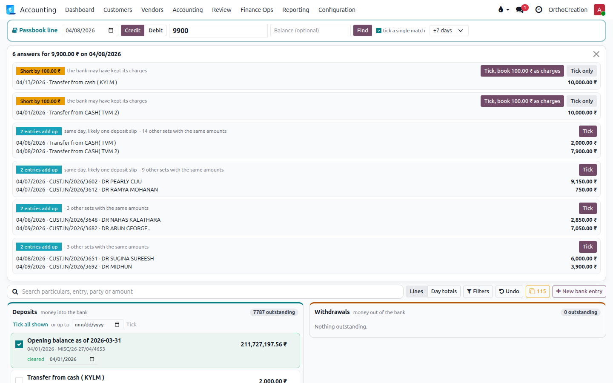

The answers can be:
- **Exact entry** — one outstanding entry of exactly that amount.
- **Batch of N** — a whole batch the bank shows as one figure, however many entries it has:
  - *Cash paid in · KYLM on …*: every outstanding cash entry of that branch that day;
  - *Everything booked on …*: every outstanding entry that day.
- **N entries add up** — two to four entries that add up to the figure, like a deposit slip
  of several cheques. *Same day* is usually the right one. If the same amounts can be made
  from other entries, it says how many other sets there are.

**Nothing fits:** the entry is probably not in the books yet. Click **Create the bank entry**:
the new-entry form opens with the amount and date filled in ([section 9](#9-new-bank-entry)).

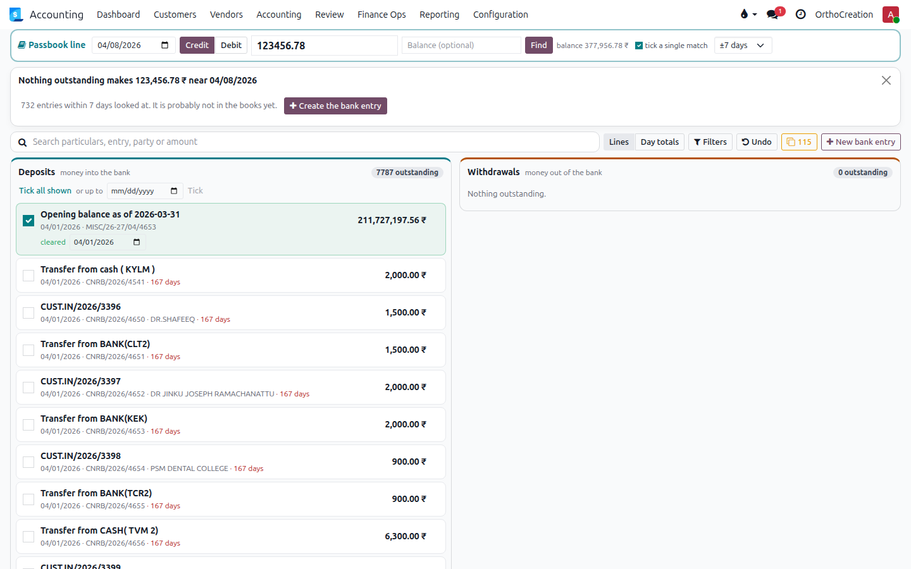

### Checking the passbook's balance column

The passbook prints a running balance after every line. Type it into **Balance
(optional)** as you go, and each line is checked against the last:

- Start by typing only the balance at the top of the page (no amount) and pressing
  **Enter**: it is noted as the starting balance.
- Then type each line's amount **and** its balance. If the balance is not the last one
  plus this credit (or less this debit), a warning says so: a passbook line was skipped,
  and the gap is its amount. **Look for …** puts that amount into the passbook line.
- The last balance you typed is shown beside **Find**. While the bank balance has not been
  entered, the next-step card offers **Use … from the passbook line**, so the closing
  balance is filled in without typing it twice.

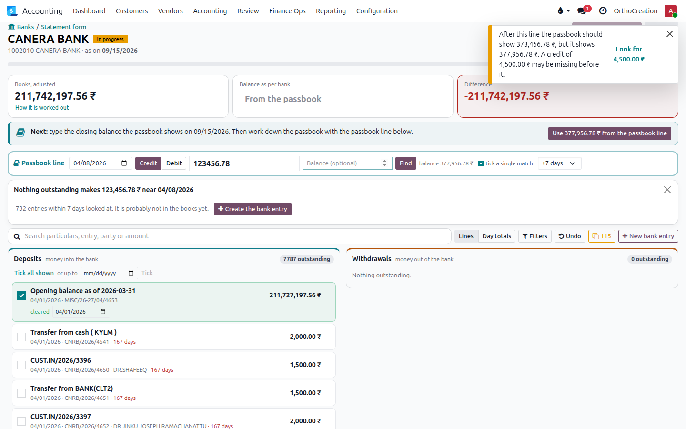

### Short credits

Banks often credit a little less than the receipt: a cheque of 10,000 credited as 9,982,
the bank having kept its charges. When no entry has the exact amount, the passbook line
also offers entries **short by** a small amount, marked in yellow:

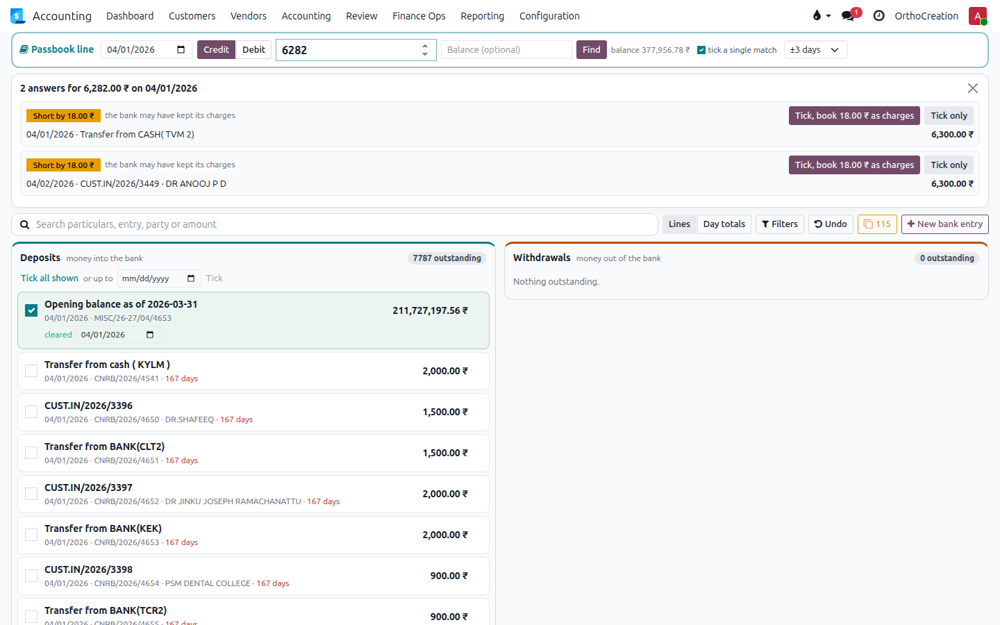

- **Tick, book … as charges** ticks the entry as cleared on the passbook date **and** posts
  the shortfall as a bank charge (against the statement's Bank Charges Account), in one click.
- **Tick only** ticks it without booking anything.
- How short counts as "near" is **Short Credits up to** on the statement form (500 by
  default). A payment the bank debited a little more than the books show is offered the
  same way.

### Settings on the passbook line

Two settings sit at the end of the passbook line:
- **tick a single match** — untick it if you want to see even a single answer before it is ticked;
- **±7 days** — how far from the passbook date to look (3, 7, 15 or 30 days).

---

## 7. Ticking entries directly

You can also tick in the columns:

- **Click a line's box** to tick or untick it.
- **Shift-click** a second box to tick (or untick) every line between the two.
- **Tick all shown** ticks every outstanding line on that side that matches the search and
  filters, each on its own date.
- **Or up to [date] ▸ Tick** ticks every outstanding line on that side booked on or before
  that date.
- **The cleared date** of a ticked line defaults to the entry's own date. Change it under
  the line if the bank cleared it on another day. A cleared date after the statement date
  leaves the line outstanding on this statement, which is correct.
- **Search** looks in particulars, entry number, reference and party. A number such as
  `1500` also finds that exact amount.

Lines of a reconciled statement show a lock and cannot be changed.

---

## 8. Entry details

**Click the text of any line** (or highlight it and press **Enter**) to open the details
panel on the right:

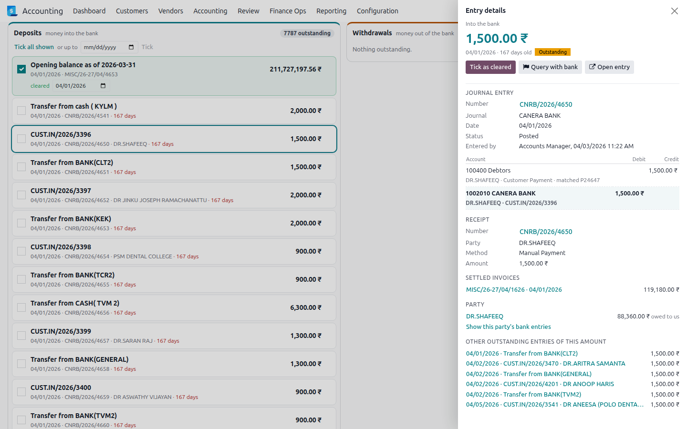

- **The amount**, the date, the age, and whether it is cleared: when, by whom, and on which
  statement.
- **Buttons:**
  - **Tick as cleared** or **Untick**;
  - **Query with bank**;
  - **Open entry** — opens the journal entry in a window, without leaving the screen.
- **Journal entry:** its number, journal, date, reference, status, who entered it and when,
  any note, and **every line** of the entry. The bank line is highlighted, and lines
  matched to invoices show their matching number.
- **Receipt / Payment:** the payment the entry belongs to, with its method and memo. Click
  its number to open it.
- **Settled invoices:** the invoices the payment settled, with any amount still due.
- **Party:** the customer or supplier, and their **ledger balance** (owed to us, or in
  advance). **Show this party's bank entries** filters the columns to them.
- **Other outstanding entries of this amount:** useful when you are not sure which of two
  similar receipts the bank has. Click one to see its details.

Press **Esc** or click outside the panel to close it.

---

## 9. New bank entry

For something the passbook shows and the books do not, click **New bank entry** (or press
**n**). The same form opens when the passbook line finds nothing:

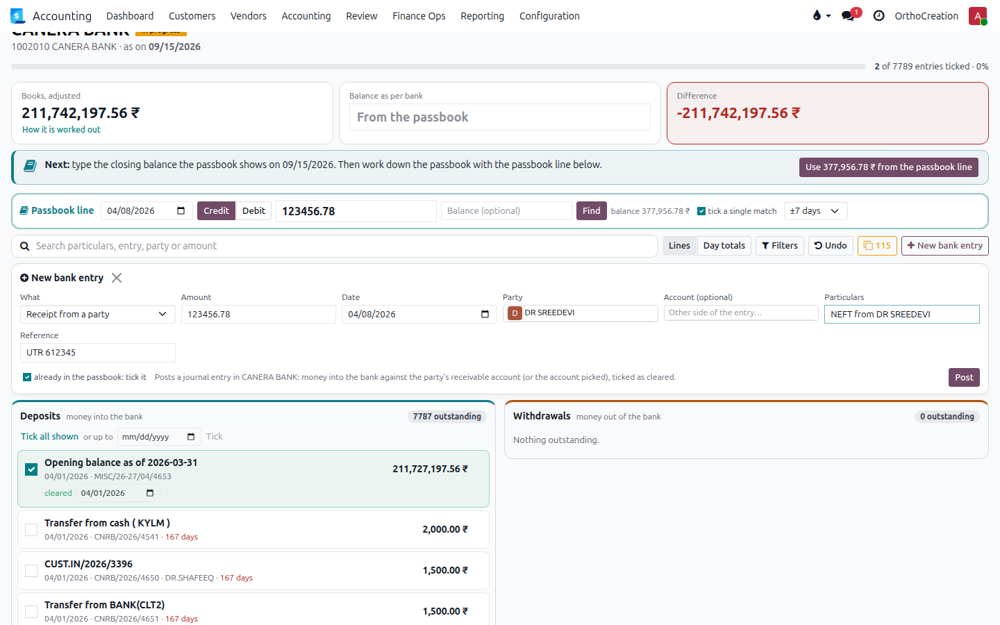

| What | Other side of the entry |
|---|---|
| **Receipt from a party** | The party's receivable account (or the account you pick). |
| **Payment to a party** | The party's payable account (or the account you pick). |
| **Other money into the bank** | The account you pick (for example a transfer account). |
| **Other money out of the bank** | The account you pick. |
| **Bank charge** | The Bank Charges Account of the statement. |
| **Interest credited** | The Interest Account of the statement. |

Fill in the amount, date, party or account, the **particulars** as in the passbook, and the
**reference** (UTR or cheque number, used as the entry's reference). Leave **already in the
passbook: tick it** on to tick the new entry as cleared; switch it off to post the entry and
leave it outstanding.

**Post** creates a real journal entry in the bank's journal, on the bank's own ledger
account, so it appears on the screen at once. The message after posting has an **Open
entry** button. The date cannot be after the statement date.

> A new entry is not undone by **Undo**. To take it back, reverse the journal entry in
> Accounting.

---

## 10. Queries with the bank, and the query letter

For an entry you cannot place, raise a query in either of two ways:
- click **Query with bank** in its details;
- click the small **flag** that appears beside its amount when you point at the line
  (or press **q**).

Type what to ask and press **Enter**:

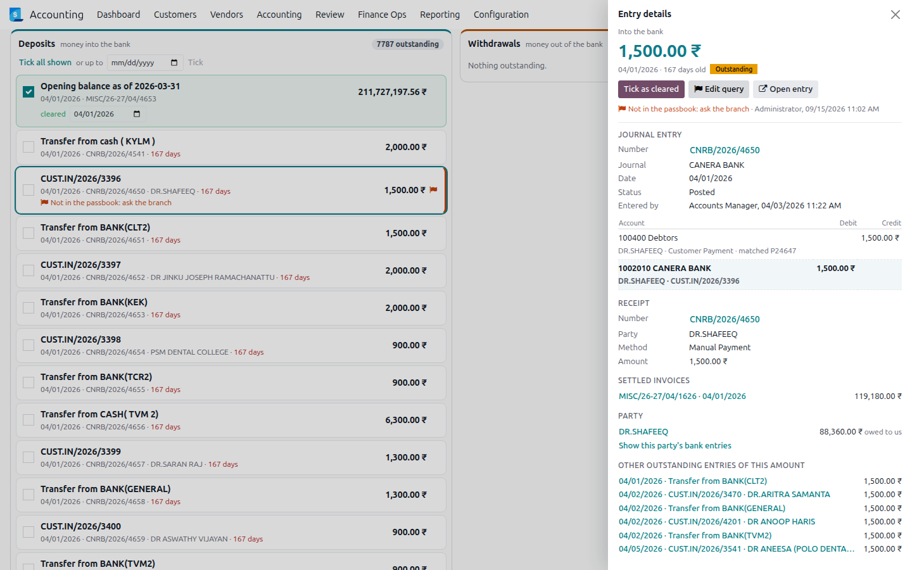

- The line shows the query in orange, and **Filters ▸ Under query** lists every such line.
- Open the query again to change it, or click **Resolved** to clear it.
- Queries do not tick anything and do not change the figures.

**More ▸ Query letter to the bank** prints a ready-to-sign letter to the branch manager. It
lists every entry under query, with its date, reference, amount, credit or debit, and your
question:

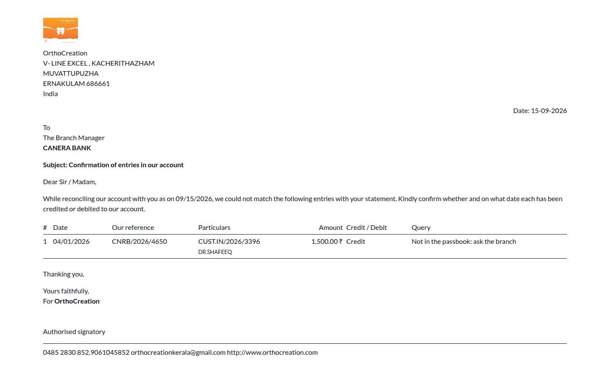

The printed BRS and the Excel file also list the entries under query.

---

## 11. Filters

**Filters** opens two rows of buttons. Each button shows a count and a total. Click one to
narrow both columns (and the day totals) to it; click it again to clear it.

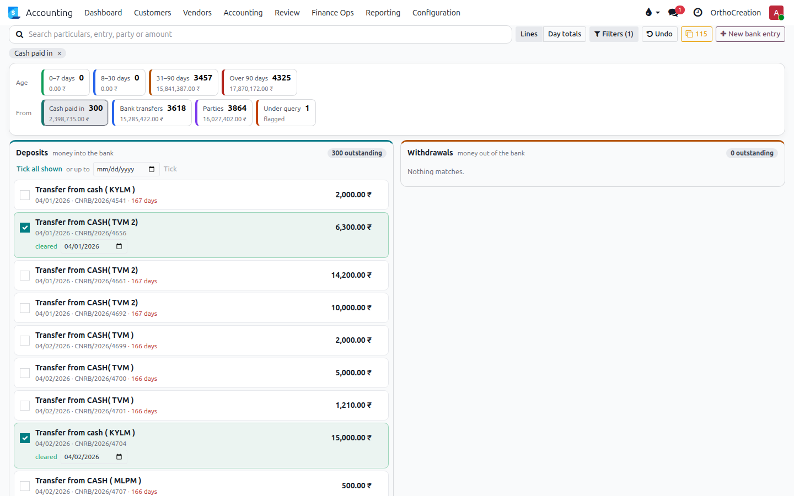

**Age** — how long entries have been outstanding: 0–7 days, 8–30 days, 31–N days, and
**over N days (stale)**. N is 90 unless changed with **Stale After (days)** on the statement
form. A cheque in India is valid for three months.

**From** — where the money came from, read off the particulars:

| Button | Lines |
|---|---|
| **Cash paid in** | "Transfer from cash ( KYLM )", "Transfer to cash (PKD)" and the like. The branch is the name in brackets. |
| **Bank transfers** | "Transfer from BANK(EKM1)", "Transfer to BANK(KYLM)" and the like. A missing closing bracket is fine. |
| **Parties** | Lines with a customer or supplier. |
| **Other** | Everything else, such as the opening balance. |
| **Under query** | Lines with a query. |
| **From before the last statement** | Entries that were already outstanding when this bank was last reconciled, and still are. These are the ones to chase first. Shown once a statement of the bank has been reconciled. |

Active filters show as **pills** under the tools. Click **×** on a pill to remove that filter.

---

## 12. Day totals

The bank usually shows a branch's cash deposit, or a day's transfers, as **one line**, while
the books have one entry per receipt. **Day totals** (or **d**) adds the outstanding entries
up the same way:

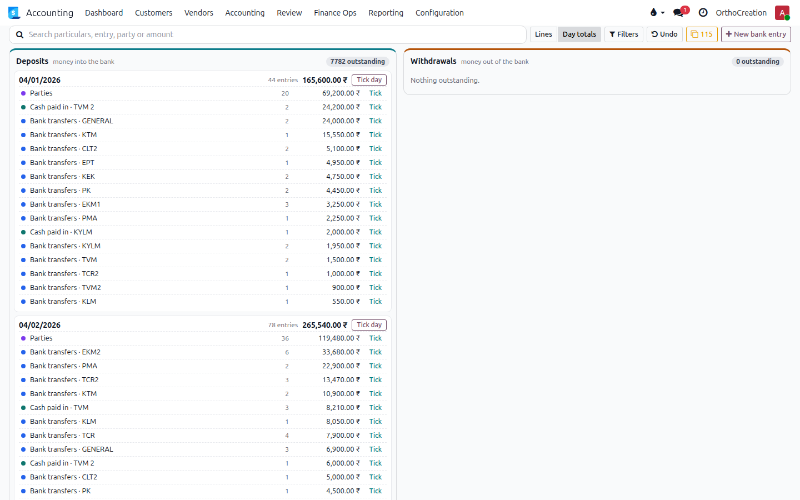

- **Each day** shows its count, its total and **Tick day**.
- **Each batch in the day** (*Cash paid in · branch*, *Bank transfers · branch*, *Parties*,
  *Other*) has its own count, total and **Tick**.

When the passbook shows "By cash KYLM 20,000" on a day, check that the *Cash paid in · KYLM*
total for that day is 20,000 and click **Tick**. A confirmation says exactly what will be
ticked.

---

## 13. Undo

Every change to the ticks is remembered: single ticks, ranges, tick all, tick up to a date,
day and batch ticks, the opening balance, and changed cleared dates. **Undo** (or **u**)
takes back the last one; hovering over it shows what it will undo, who did it and when.

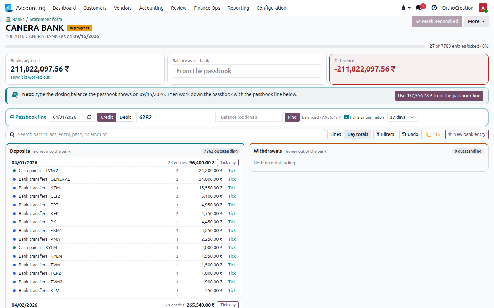

- Undo goes back one step at a time, up to the last 50 changes.
- It does not remove posted bank entries (see [section 9](#9-new-bank-entry)).
- The history ends when the statement is marked reconciled.

---

## 14. Possible duplicates

When outstanding entries from the **same party**, of the **same amount**, sit within **three
days** of each other, the tools show a yellow button with the number of such groups. One of
them may have been booked twice, which would leave it outstanding for good.

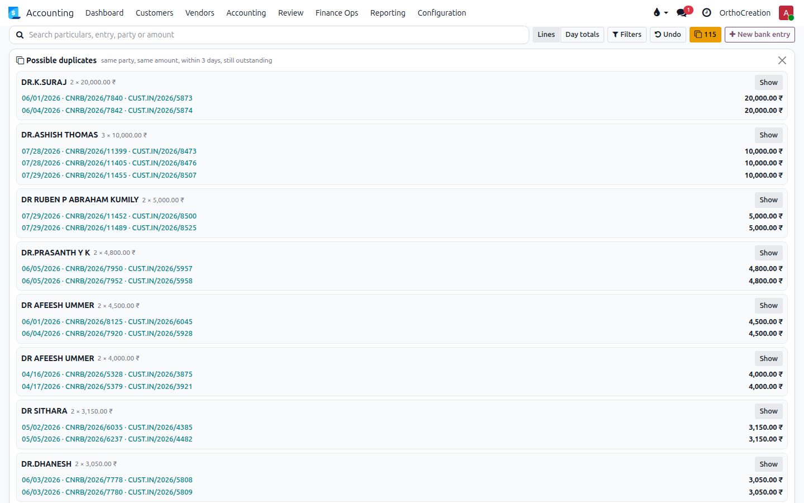

- **Show** filters the columns to that party.
- Click an entry to open its details.
- A doubled entry is corrected in Accounting (usually by reversing the extra receipt), not
  by ticking.

---

## 15. "Why is there a difference?"

Once the bank balance is typed, and while the difference is not zero, the next-step card
looks through the ledger for what explains it:

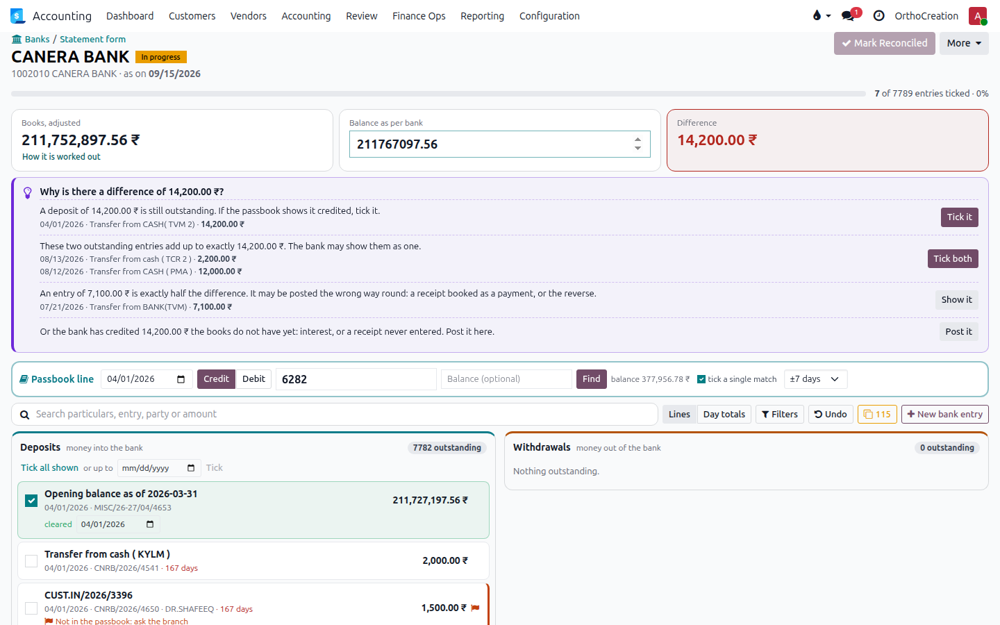

| Hint | Meaning | Button |
|---|---|---|
| **A deposit / payment of X is still outstanding** | Ticking that entry closes the difference exactly. | **Tick it** |
| **A deposit / payment of X is ticked, but…** | Unticking it closes the difference. | **Untick it** |
| **These two outstanding entries add up to exactly X** | The bank may show them as one. | **Tick both** |
| **An entry of X is exactly half the difference** | It may be posted the wrong way round. | **Show it** |
| **An entry of X is booked after the statement date** | Its accounting date may be wrong. | — |
| **The difference divides exactly by 9** | Two digits may be swapped, in the balance typed or in an entry. | — |
| **Or the bank has credited / debited X the books do not have** | Interest, charges, a receipt or payment never entered. | **Post it** (opens the new-entry form with the amount) |

Check each hint against the passbook before acting on it.

---

## 16. Mark Reconciled, and the next statement

When the difference is **0.00** and the bank balance has been typed, the next-step card
says the books agree with the bank:

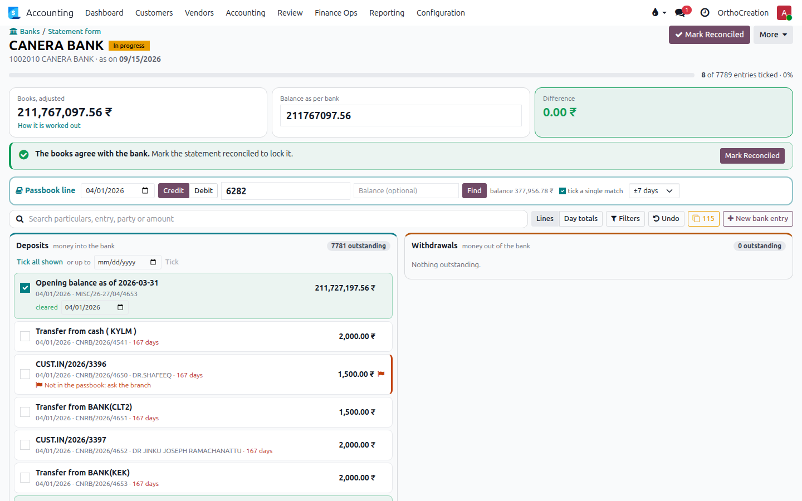

Click **Mark Reconciled** (in the card or the header). Then:

- The statement becomes **Reconciled**.
- Every line cleared on or before its date is **locked** to it.
- The undo history ends.
- The chatter records the bank balance.

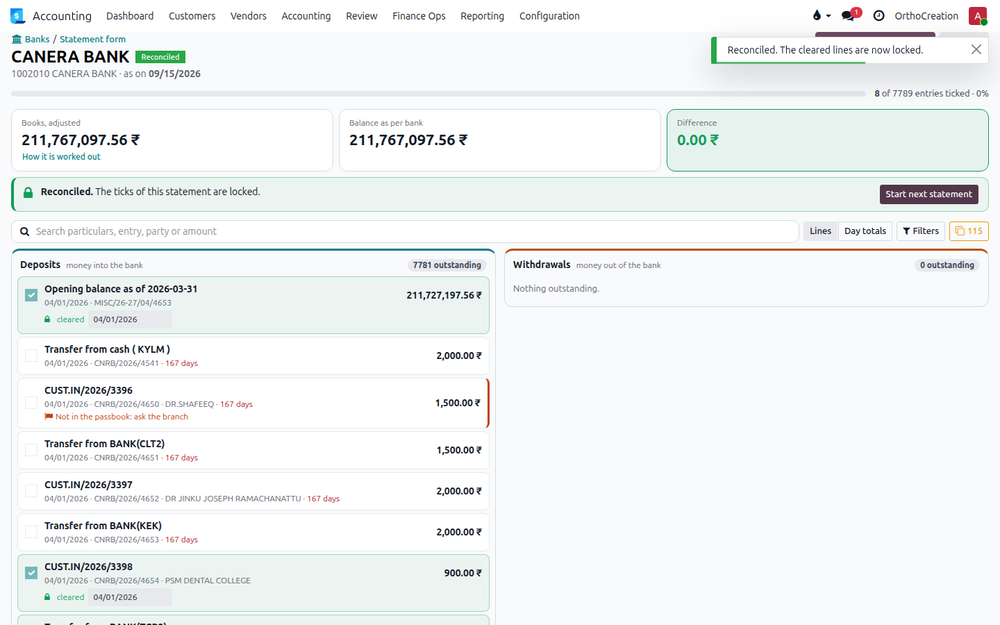

**Start next statement** opens the bank's next statement:
- dated today, or the day after this one if that is later;
- with the same charges and interest accounts and stale limit.

Statements of one account are reconciled **in date order**. To change a reconciled
statement, an **Administrator** clicks **Reopen** on its form; reopen the latest one first.

The statement form keeps the settings and figures, with the same buttons:

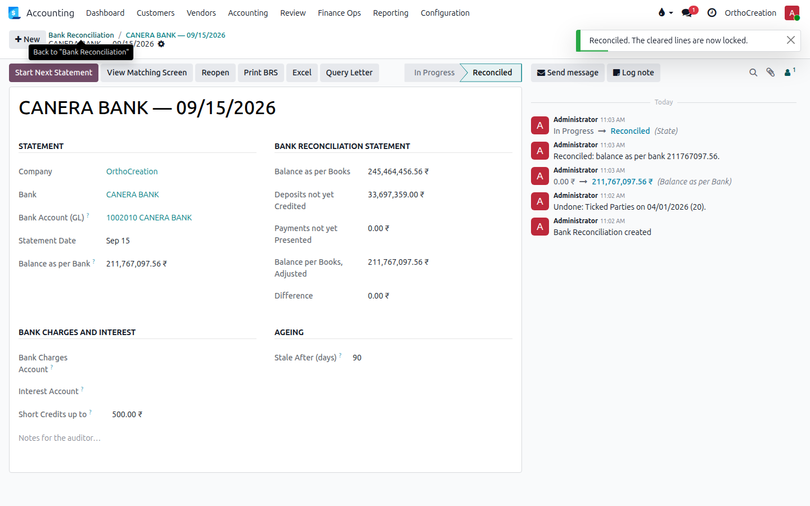

**Accounting ▸ Accounting ▸ Bank Reconciliation Statements** lists all statements:

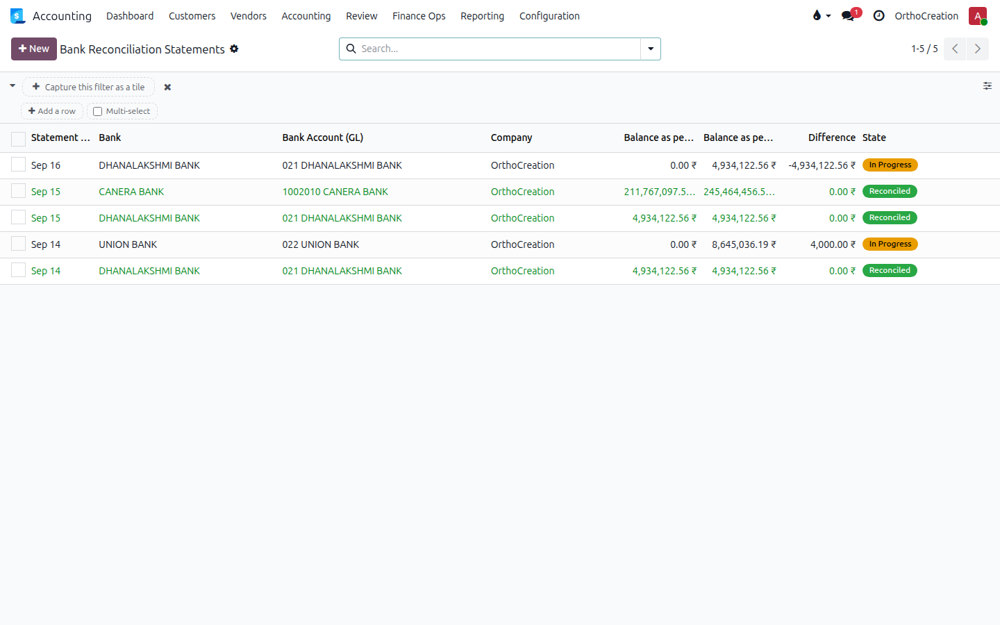

The overview then shows the bank as reconciled:

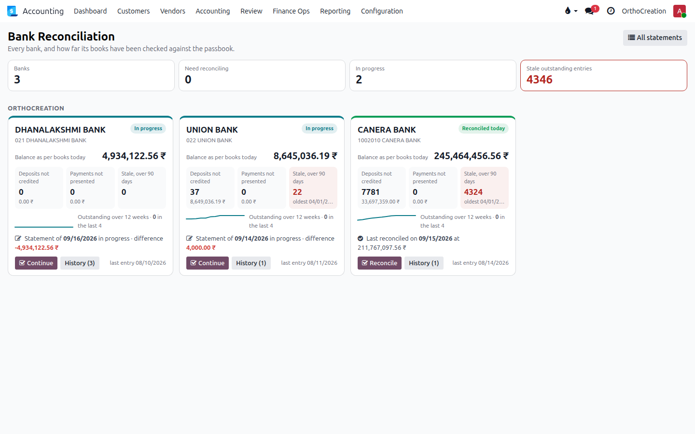

---

## 17. Printing: the BRS, Excel and the More menu

**More** in the header holds:
- **Print BRS**;
- **Excel**;
- **Query letter to the bank**, when there are queries;
- **Keyboard shortcuts**;
- **Statement settings** (the form).

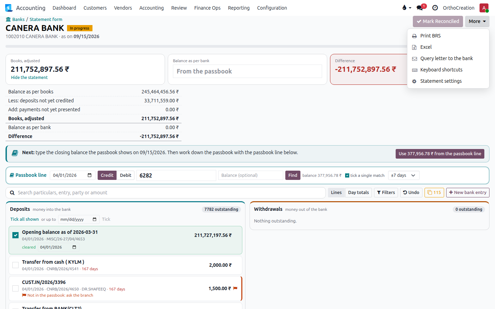

**Print BRS** prints:
- the six figures;
- outstanding items by age;
- the entries under query;
- every deposit not yet credited and payment not yet presented, with its age (marked
  *stale* over the limit).

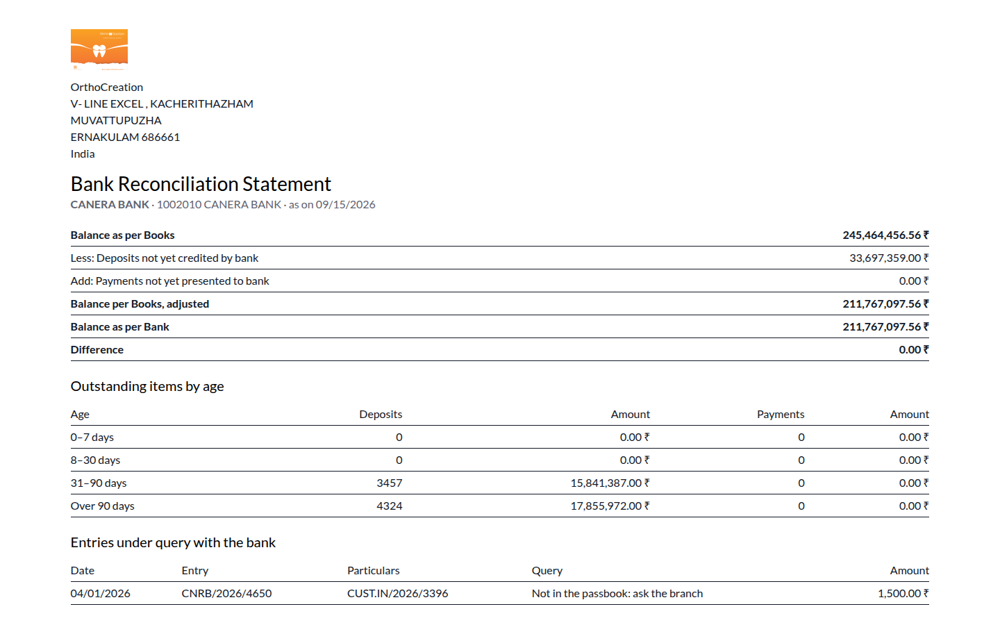

**Excel** downloads the same content for audit working papers. Any statement can be printed
at any time, and an old statement reprints exactly as it was reconciled.

---

## 18. Keyboard shortcuts

When you are not typing in a field:

| Key | Action |
|---|---|
| **p** | Go to the passbook line |
| **↓ / ↑** or **j / k** | Move between lines |
| **Space** or **x** | Tick / untick the highlighted line |
| **Enter** or **o** | Open the highlighted line's details |
| **q** | Query the highlighted line |
| **u** | Undo |
| **n** | New bank entry |
| **d** | Lines / Day totals |
| **/** | Search |
| **Esc** | Close the details or the form, or leave a field |
| **Shift-click** | Tick a range of lines |

---

## 19. Phone and tablet

Everything works on a phone. The figures and columns stack; the details panel fills the screen.

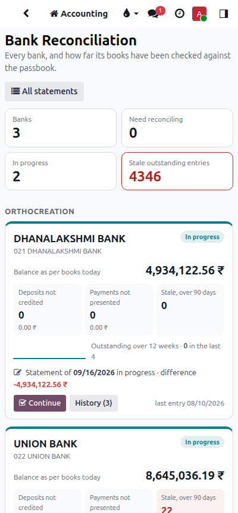
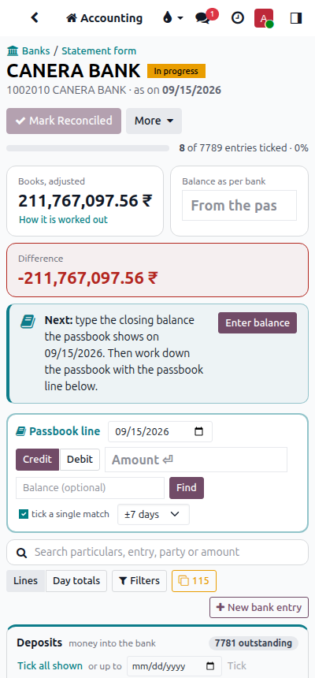

---

## 20. Rules the module enforces

| Rule | Why |
|---|---|
| Only posted lines of the statement's bank account, dated on or before the statement date, can be ticked or queried. | A statement covers exactly that. |
| A line can be cleared only once, and carries at most one query. | One clearance, one open question per entry. |
| **Mark Reconciled** needs a bank balance and a zero difference. | Otherwise it is not a reconciliation. |
| Statements of one account are reconciled in date order. | Each builds on the last. |
| Lines of a reconciled statement are locked; its undo history ends. | What was signed stays as signed. |
| Undo covers ticks and cleared dates, not posted bank entries. | A posted entry is reversed in Accounting, with its own audit trail. |
| New bank entries cannot be dated after the statement date. | They would not be on this statement. |
| Only an Administrator can reopen, latest first. | Control. |
| Each company sees only its own statements, ticks, undo history and queries. | Multi-company. |

---

## 21. Questions and troubleshooting

**The difference is huge on the first statement.**
Tick the opening balance from the next-step card ([section 5](#5-first-reconciliation-the-opening-balance)).

**The passbook shows one cash deposit, but the books have a dozen receipts.**
Type the passbook figure into the passbook line; it finds the branch's day as a batch. Or use
**Day totals** ([section 12](#12-day-totals)).

**The passbook shows something the books do not have.**
Type it into the passbook line and click **Create the bank entry**, or use **New bank entry**
([section 9](#9-new-bank-entry)).

**Withdrawals are almost empty though the passbook has many debits.**
Most bank payments have not been entered in these books through the bank account. Post them
with **New bank entry** as payments to parties or other money out of the bank.

**I ticked the wrong line.**
Click **Undo** (or press **u**). In a reconciled statement, ask an Administrator to reopen it.

**"Mark Reconciled" is greyed out.**
Either the difference is not zero, or the bank balance has not been typed. The next-step
card says which.

**Where do I see who entered or ticked an entry?**
Open its details ([section 8](#8-entry-details)): who entered the journal entry and when, and
who cleared the bank line and when.

**The screen says it "lost track of its statement".**
The page was reloaded. Click **Open the banks**, then **Continue**.

---

## 22. Glossary

| Term | Meaning |
|---|---|
| **BRS** | Bank Reconciliation Statement: the proof that the books and the bank agree. |
| **Statement date** | The date the passbook balance is taken at. |
| **Passbook line** | One line of the passbook, typed into the screen to find its entry. |
| **Cleared** | The bank has credited or debited the entry. **Cleared date**: when. |
| **Outstanding** | Booked, but not cleared by the statement date. |
| **Deposit not yet credited** | Money in the books' bank account the bank has not credited yet. |
| **Payment not yet presented** | Money out of the books' bank account the bank has not debited yet. |
| **Stale** | Outstanding for longer than the stale limit (90 days by default). |
| **Short credit** | A receipt the bank credited a little less than the books show, usually because it kept its charges. |
| **Carried over** | Outstanding since before the last reconciled statement. |
| **Batch** | Entries the bank shows as one figure: a branch's cash or transfers for a day, or a whole day. |
| **Query** | A note on an entry being followed up with the bank. |
| **Bank entry** | A journal entry posted from the screen in the bank's journal. |
| **General journal entry** | An entry posted from the general journal, such as the opening balance. |
